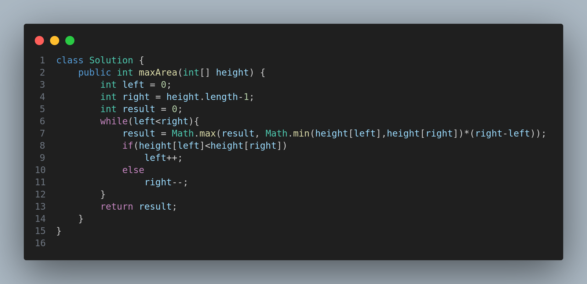

# 🧩 Container With Most Water – LeetCode 11

## 📘 Problem Description

You are given an integer array **`height`** of length **`n`**, where each element represents the height of a vertical line drawn on the x-axis at position `i`.

Your task is to **find two lines that, together with the x-axis, form a container that holds the maximum amount of water**.

💧 The container must be vertical (you cannot slant it).

---

## 🧮 Example 1

**Input:**

```
height = [1,8,6,2,5,4,8,3,7]
```

**Output:**

```
49
```

**Explanation:**

* The lines at indices **1** and **8** form the container with the largest area.
* Width = (8 - 1) = 7
* Height = min(8, 7) = 7
* **Area = 7 × 7 = 49**

---

## 🧮 Example 2

**Input:**

```
height = [1,1]
```

**Output:**

```
1
```

---

## ⚙️ Constraints

* `n == height.length`
* `2 <= n <= 10^5`
* `0 <= height[i] <= 10^4`

---

## 🧠 Approach

The **two-pointer approach** is used to solve this efficiently:

1. Initialize two pointers — one at the start (`left`) and one at the end (`right`).
2. Compute the area formed by the two heights and update the maximum if it’s larger.
3. Move the pointer pointing to the **shorter line** inward (since moving the taller one cannot increase the area).
4. Continue until both pointers meet.

This guarantees an **O(n)** solution.

---

## 🧩 Solution Representation



---

## ⏱️ Complexity Analysis

* **Time Complexity:** `O(n)` – Each element is visited at most once.
* **Space Complexity:** `O(1)` – Constant extra space used.


