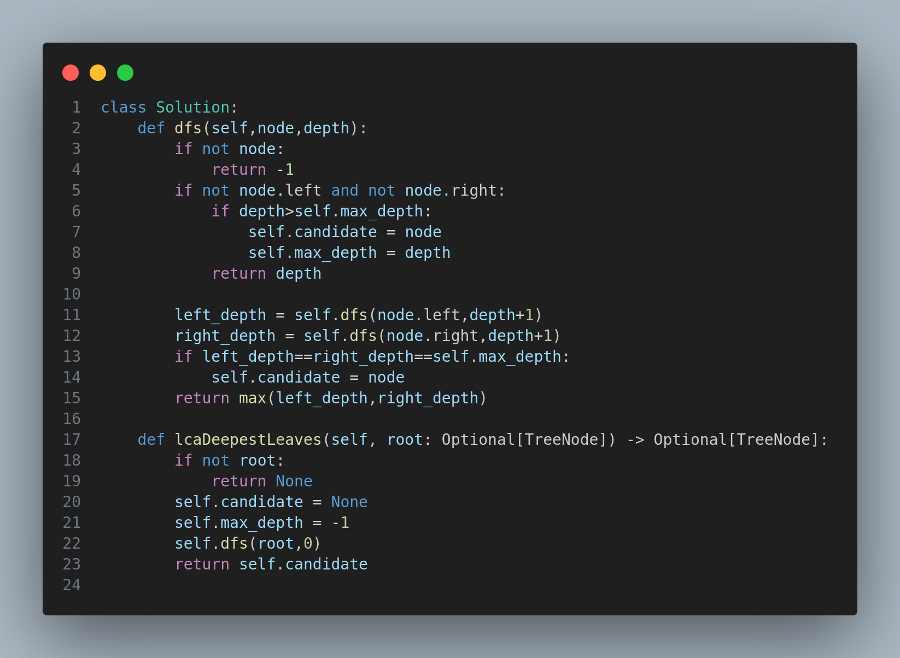

# 1123. Lowest Common Ancestor of Deepest Leaves

## Problem Statement
Given the root of a binary tree, return the lowest common ancestor (LCA) of its deepest leaves.

### Definition:
- A node in a binary tree is a **leaf** if and only if it has no children.
- The depth of the root of the tree is `0`. If the depth of a node is `d`, the depth of each of its children is `d + 1`.
- The **lowest common ancestor (LCA)** of a set `S` of nodes is the node `A` with the largest depth such that every node in `S` is in the subtree rooted at `A`.

## Examples

### Example 1:
**Input:**
```
root = [3,5,1,6,2,0,8,null,null,7,4]
```
**Output:**
```
[2,7,4]
```
**Explanation:**
- The deepest leaf nodes are `7` and `4`.
- Their lowest common ancestor is `2`.

### Example 2:
**Input:**
```
root = [1]
```
**Output:**
```
[1]
```
**Explanation:**
- The root is the deepest node, so it's the LCA of itself.

### Example 3:
**Input:**
```
root = [0,1,3,null,2]
```
**Output:**
```
[2]
```
**Explanation:**
- The deepest leaf node is `2`, so it's its own LCA.

## Constraints
- The number of nodes in the tree is in the range `[1, 1000]`.
- `0 <= Node.val <= 1000`
- The values of the nodes in the tree are **unique**.

---

## Solution Approach
The solution is implemented using **Depth-First Search (DFS)**. Here’s how the approach works:

1. **Recursive Traversal**
   - Perform a depth-first traversal of the tree to compute the depth of each node.
   - Maintain a variable `max_depth` to track the maximum depth encountered.

2. **Tracking Deepest Leaves**
   - If a leaf node is found with a depth greater than `max_depth`, update `max_depth` and mark the node as a candidate for LCA.

3. **Identifying LCA**
   - If both left and right subtrees return the same `max_depth`, then the current node is the LCA.

4. **Returning the Result**
   - The function `lcaDeepestLeaves()` calls `dfs()`, and the final `candidate` node is returned as the result.

## Code Implementation
<p align="center">
  
</p>

### Complexity Analysis
- **Time Complexity:** \(O(n)\), where `n` is the number of nodes in the tree, since we traverse each node once.
- **Space Complexity:** \(O(h)\), where `h` is the height of the tree due to recursion depth.

### Example Usage
```python
solution = Solution()
result = solution.lcaDeepestLeaves(root)
print(result.val)  # Output will be the value of the LCA node
```

---

⭐ *If you have any suggestions or optimizations, feel free to contribute!* 🚀

