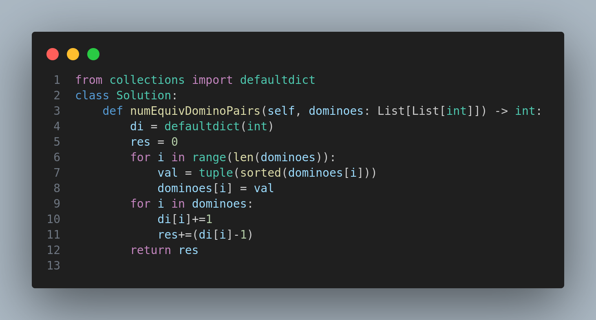

# Number of Equivalent Domino Pairs

## Problem Description

Given a list of dominoes, each represented as a list of two integers `dominoes[i] = [a, b]`, two dominoes are considered **equivalent** if:

* (a == c and b == d), or
* (a == d and b == c)

This means one domino can be rotated to become equal to the other.

Return the number of pairs `(i, j)` such that `0 <= i < j < dominoes.length`, and `dominoes[i]` is equivalent to `dominoes[j]`.

---

## Examples

### Example 1

**Input:** `dominoes = [[1,2],[2,1],[3,4],[5,6]]`
**Output:** `1`

Only one pair `[1,2]` and `[2,1]` is equivalent.

### Example 2

**Input:** `dominoes = [[1,2],[1,2],[1,1],[1,2],[2,2]]`
**Output:** `3`

The three equivalent pairs are:

* `[1,2]` and `[1,2]`
* `[1,2]` and `[1,2]` (with the third occurrence)
* the first and third `[1,2]`

---

## Constraints

* `1 <= dominoes.length <= 4 * 10^4`
* Each `dominoes[i]` is a list of two integers
* `1 <= dominoes[i][j] <= 9`

---

## Notes

This problem is a good use-case for using hashing (via a dictionary) to keep track of seen normalized dominoes. A domino like `[2,1]` is normalized to `[1,2]` before counting to ensure rotational equivalence is handled correctly.

---
