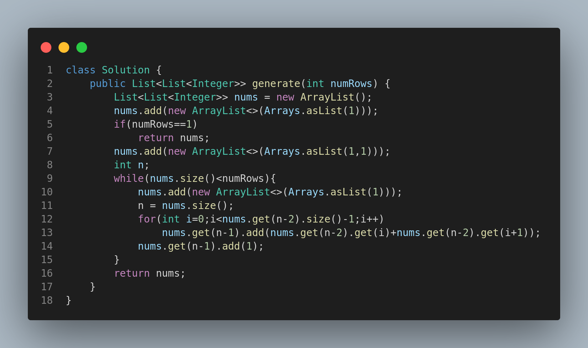

# 118. Pascal's Triangle

## 🧩 Problem Description

Given an integer `numRows`, return the first `numRows` of **Pascal's triangle**.

In Pascal's triangle, each number is the sum of the two numbers directly above it.

---

## 🧪 Examples

### Example 1:

**Input:** `numRows = 5`
**Output:** `[[1],[1,1],[1,2,1],[1,3,3,1],[1,4,6,4,1]]`

### Example 2:

**Input:** `numRows = 1`
**Output:** `[[1]]`

---

## 🧠 Constraints

* `1 <= numRows <= 30`

---

##  Code Representation

The solution is implemented in Java:

