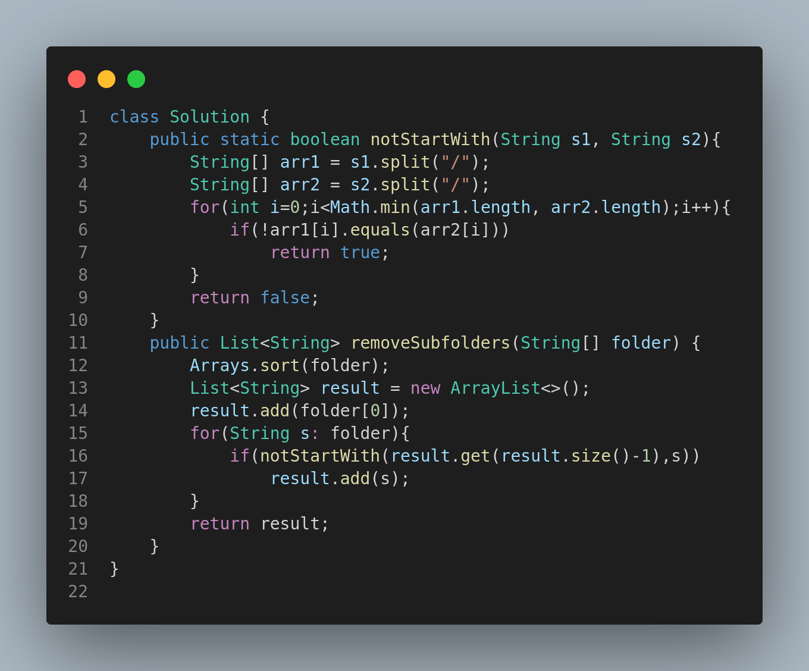

# 1233. Remove Sub-Folders from the Filesystem

## Problem Statement

Given a list of folder paths, return the folders **after removing all sub-folders**. A folder `folder[i]` is a sub-folder of `folder[j]` if it starts with `folder[j]` followed by a `/`.

The format of a path is one or more concatenated strings of the form: `/` followed by one or more lowercase English letters.

---

## Examples

### Example 1:

**Input:**

```
folder = ["/a","/a/b","/c/d","/c/d/e","/c/f"]
```

**Output:**

```
["/a","/c/d","/c/f"]
```

**Explanation:**

* "/a/b" is a subfolder of "/a".
* "/c/d/e" is a subfolder of "/c/d".

### Example 2:

**Input:**

```
folder = ["/a","/a/b/c","/a/b/d"]
```

**Output:**

```
["/a"]
```

**Explanation:**

* Both "/a/b/c" and "/a/b/d" are subfolders of "/a".

### Example 3:

**Input:**

```
folder = ["/a/b/c","/a/b/ca","/a/b/d"]
```

**Output:**

```
["/a/b/c","/a/b/ca","/a/b/d"]
```

**Explanation:**

* None of the folders are subfolders of the others.

---

## Constraints

* `1 <= folder.length <= 4 * 10^4`
* `2 <= folder[i].length <= 100`
* `folder[i]` contains only lowercase letters and `/`
* Each `folder[i]` starts with `/`
* All folder names are unique

---

## Approach

1. **Sort the folder paths** lexicographically.
2. Initialize a result list with the first folder.
3. For each subsequent folder:

   * Check whether it is a subfolder of the last added folder in the result.
   * If not, add it to the result list.

The idea is that once the list is sorted, any subfolder will appear after its parent. So we only need to check whether the current folder starts with the last added folder in the result followed by a `/`.

---

## Code Representation



---

## Summary

* This problem uses a **greedy + string comparison** approach.
* Sorting ensures that subfolders appear after their parents.
* We filter by checking the prefix structure.

**Time Complexity:** O(n log n) — due to sorting
**Space Complexity:** O(n) — to store the result list

---
