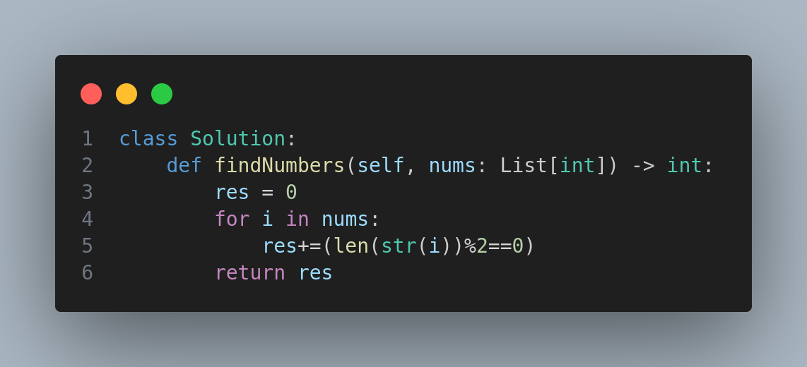

# 1295. Find Numbers with Even Number of Digits

## Problem Description
Given an array `nums` of integers, return how many of them contain an even number of digits.

### Example 1:
**Input:** `nums = [12,345,2,6,7896]`  
**Output:** `2`  
**Explanation:**
- 12 contains 2 digits (even).
- 345 contains 3 digits (odd).
- 2 contains 1 digit (odd).
- 6 contains 1 digit (odd).
- 7896 contains 4 digits (even).

Only `12` and `7896` meet the criteria.

### Example 2:
**Input:** `nums = [555,901,482,1771]`  
**Output:** `1`  
**Explanation:** Only `1771` has an even number of digits.

## Constraints
- `1 <= nums.length <= 500`
- `1 <= nums[i] <= 10^5`

## Visual Representation

