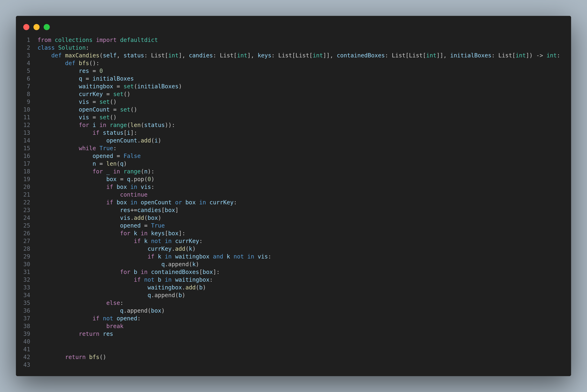

# 1298. Maximum Candies You Can Get from Boxes

## Problem Statement

You have `n` boxes labeled from `0` to `n - 1`. Each box may contain:

* A certain number of candies
* A set of keys to open other boxes
* A list of other boxes inside it
* And an `open/closed` status

You are given:

* `status`: where `status[i] == 1` if box `i` is open, else `0`
* `candies[i]`: number of candies in box `i`
* `keys[i]`: keys to other boxes inside box `i`
* `containedBoxes[i]`: boxes found inside box `i`
* `initialBoxes`: boxes you start with

You may only open a box if:

* It is already open, or
* You have a key to open it

Return the **maximum number of candies** you can collect.

---

## Example

### Example 1:

**Input:**

```
status = [1,0,1,0]
candies = [7,5,4,100]
keys = [[],[],[1],[]]
containedBoxes = [[1,2],[3],[],[]]
initialBoxes = [0]
```

**Output:**

```
16
```

**Explanation:**

* Start with box 0 → 7 candies and find boxes 1 and 2
* Box 1 is closed, box 2 is open → open box 2
* Box 2 gives 4 candies and key to box 1
* Use key to open box 1 → 5 candies and find box 3 (closed, no key)
* Total = 7 + 4 + 5 = **16 candies**

### Example 2:

**Input:**

```
status = [1,0,0,0,0,0]
candies = [1,1,1,1,1,1]
keys = [[1,2,3,4,5],[],[],[],[],[]]
containedBoxes = [[1,2,3,4,5],[],[],[],[],[]]
initialBoxes = [0]
```

**Output:**

```
6
```

---

## Constraints

* `n == status.length == candies.length == keys.length == containedBoxes.length`
* `1 <= n <= 1000`
* `status[i]` is either `0` or `1`
* `1 <= candies[i] <= 1000`
* `0 <= keys[i].length <= n`
* All keys and boxes are valid and unique
* `0 <= initialBoxes.length <= n`

---

## Approach

We use **Breadth-First Search (BFS)** to simulate the process:

* Maintain a queue of boxes to explore
* Track collected keys, visited boxes, and newly found boxes
* When a box can be opened (either already open or we have the key), collect candies, add keys, and add contained boxes to the queue
* Repeat until no new boxes can be opened

---

## Code Illustration

The logic can be visualized through the `image.png` below:



---

## Complexity Analysis

* **Time Complexity:** `O(n + m)`, where `n` is number of boxes and `m` is total items (keys, contained boxes)
* **Space Complexity:** `O(n)` for visited set, key set, and queue

---

## Summary

This greedy + BFS approach ensures all accessible paths are explored for maximum candy collection.

---

