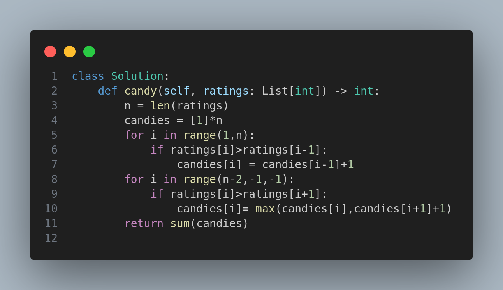

# LeetCode 135: Candy

## Problem Statement

There are `n` children standing in a line. Each child is assigned a rating value given in the integer array `ratings`.

You are giving candies to these children subjected to the following requirements:

1. Each child must have at least one candy.
2. Children with a higher rating get more candies than their neighbors.

Return the **minimum number of candies** you need to have to distribute the candies to the children.

---

## Example 1

**Input:**

```
ratings = [1,0,2]
```

**Output:**

```
5
```

**Explanation:**
You can allocate to the first, second, and third child with 2, 1, and 2 candies respectively.

---

## Example 2

**Input:**

```
ratings = [1,2,2]
```

**Output:**

```
4
```

**Explanation:**
You can allocate to the first, second, and third child with 1, 2, and 1 candies respectively. The third child gets 1 candy because it satisfies the above two conditions.

---

## Constraints

* `n == ratings.length`
* `1 <= n <= 2 * 10^4`
* `0 <= ratings[i] <= 2 * 10^4`

---

## Approach

To satisfy both conditions, perform two passes:

1. **Left to Right**: Give more candies to children with higher ratings than the left neighbor.
2. **Right to Left**: Ensure children with higher ratings than the right neighbor get more candies.

After both passes, summing up the `candies` array gives the minimum candies needed.

---

## Code



---

## Complexity Analysis

* **Time Complexity:** `O(n)`
* **Space Complexity:** `O(n)`

---

## Tags

`Greedy`, `Array`

---

## Similar Problems

* LeetCode 122: Best Time to Buy and Sell Stock II
* LeetCode 455: Assign Cookies
