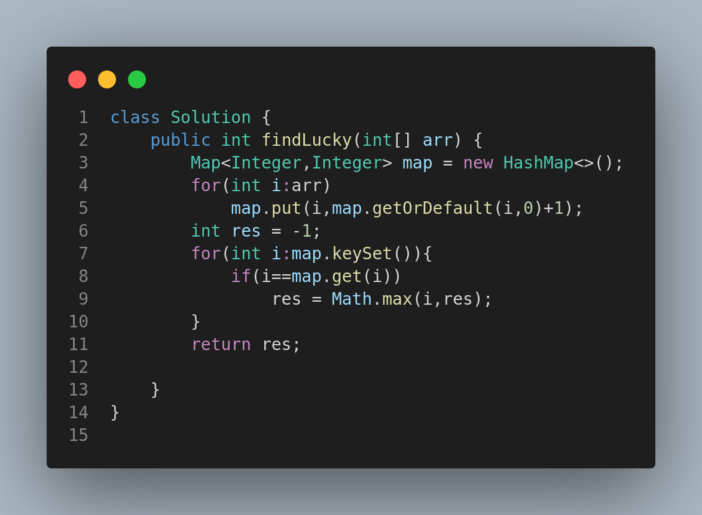

# 1394. Find Lucky Integer in an Array

## Problem Statement

Given an array of integers `arr`, a lucky integer is an integer that has a frequency in the array equal to its value.

Return the largest lucky integer in the array. If there is no lucky integer return `-1`.

---

## Examples

### Example 1:

**Input:**

```
arr = [2,2,3,4]
```

**Output:**

```
2
```

**Explanation:**
The only lucky number in the array is 2 because frequency\[2] == 2.

### Example 2:

**Input:**

```
arr = [1,2,2,3,3,3]
```

**Output:**

```
3
```

**Explanation:**
1, 2 and 3 are all lucky numbers. The largest is 3.

### Example 3:

**Input:**

```
arr = [2,2,2,3,3]
```

**Output:**

```
-1
```

**Explanation:**
There are no lucky numbers in the array.

---

## Constraints

* `1 <= arr.length <= 500`
* `1 <= arr[i] <= 500`

---

## Approach

1. Count the frequency of each number using a hashmap.
2. Iterate over the keys and check if the frequency is equal to the number.
3. Track the maximum such number.
4. Return the result, or -1 if no lucky number found.

---

## Code Representation



---

## Summary

* Uses hashmap for frequency count.
* Simple linear scan to find the largest lucky number.
* Straightforward frequency analysis problem.

---
