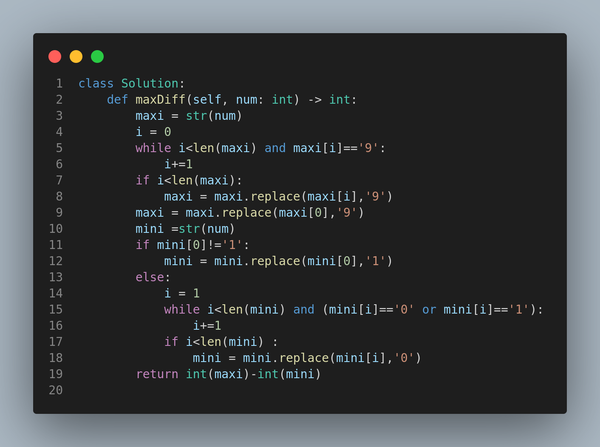

# 1432. Max Difference You Can Get From Changing an Integer

## Problem Statement

You are given an integer `num`. You will apply the following steps to `num` two separate times:

1. Pick a digit `x` (0 <= x <= 9).
2. Pick another digit `y` (0 <= y <= 9). Note `y` can be equal to `x`.
3. Replace all the occurrences of `x` in the decimal representation of `num` by `y`.

Let `a` and `b` be the two results from applying the operation to `num` independently.

Return the **maximum difference** between `a` and `b`.

📌 **Note:**

* Neither `a` nor `b` may have any leading zeros.
* Neither value may be 0.

---

## Examples

### Example 1:

**Input:**

```
num = 555
```

**Output:**

```
888
```

**Explanation:**

* Max: Replace `5` with `9` → 999
* Min: Replace `5` with `1` → 111
* Max diff = 999 - 111 = 888

### Example 2:

**Input:**

```
num = 9
```

**Output:**

```
8
```

**Explanation:**

* Max: Replace `9` with `9` → 9
* Min: Replace `9` with `1` → 1
* Max diff = 9 - 1 = 8

---

## Constraints

* `1 <= num <= 10^8`

---

## Visual Representation



---

## Summary

* The task involves string replacement and understanding digit remapping rules.
* Handle leading digits carefully to avoid leading zeros.
* The core logic lies in the greedy selection of digits for max/min transformation.

---


