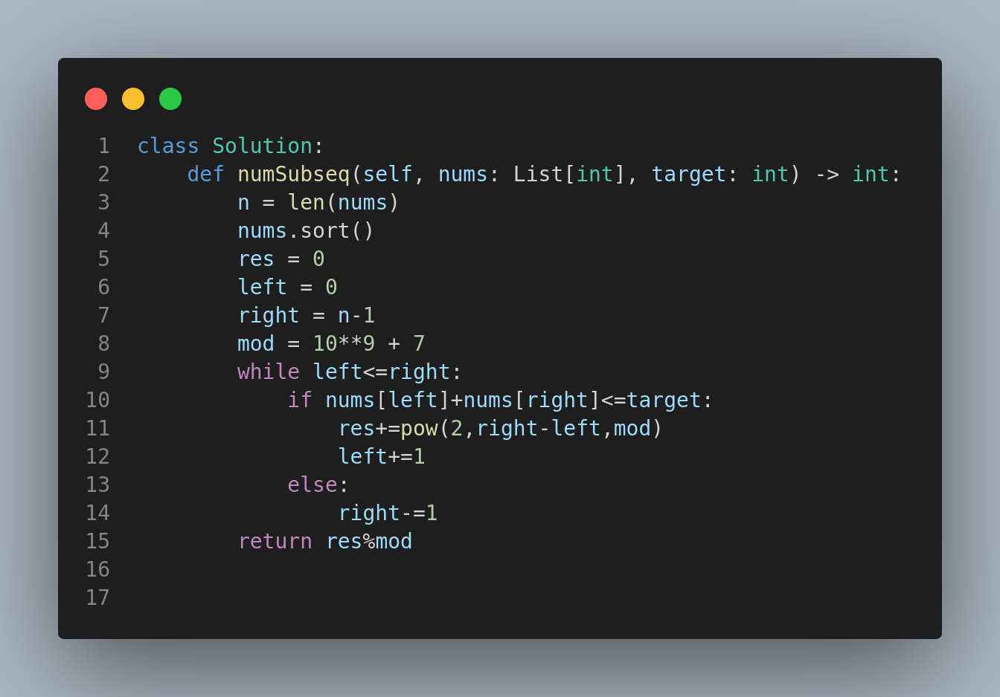

# 1498. Number of Subsequences That Satisfy the Given Sum Condition

## Problem Statement

You are given an array of integers `nums` and an integer `target`.

Return the number of **non-empty subsequences** of `nums` such that:

> The sum of the **minimum** and **maximum** elements in the subsequence is **less than or equal to** `target`.

Since the answer may be too large, return it modulo **10⁹ + 7**.

---

## 🧪 Examples

### Example 1:

**Input:**

```python
nums = [3,5,6,7], target = 9
```

**Output:**

```
4
```

**Explanation:**
The valid subsequences are:

* \[3]
* \[3,5]
* \[3,5,6]
* \[3,6]

---

### Example 2:

**Input:**

```python
nums = [3,3,6,8], target = 10
```

**Output:**

```
6
```

**Explanation:**
The valid subsequences include:

* \[3]
* \[3]
* \[3,3]
* \[3,6]
* \[3,6]
* \[3,3,6]

---

### Example 3:

**Input:**

```python
nums = [2,3,3,4,6,7], target = 12
```

**Output:**

```
61
```

**Explanation:**

* Total non-empty subsequences: 2⁶ - 1 = 63
* Invalid: \[6,7], \[7]
* Valid subsequences: 63 - 2 = 61

---

## 🧠 Approach

### Intuition:

To count valid subsequences efficiently, we:

1. **Sort** the array to simplify min and max lookups.
2. Use a **two-pointer** strategy:

   * One pointer at the start (`left`), and another at the end (`right`).
   * If `nums[left] + nums[right] <= target`, then all subsets between `left` and `right` are valid.

### Algorithm:

1. Sort the array.
2. Initialize two pointers: `left = 0`, `right = len(nums) - 1`.
3. While `left <= right`:

   * If `nums[left] + nums[right] <= target`, then:

     * Count all subsets between left and right: `2^(right - left)`.
     * Move `left` right.
   * Else:

     * Decrease `right`.

### Python Code:



---

## ⏱️ Complexity

* **Time Complexity:** O(n log n) for sorting + O(n) traversal
* **Space Complexity:** O(1) (ignoring the sorting space and precomputation of powers if done inline)

---

## 🔑 Summary

* Greedy + Two Pointers + Sorting + Modulo arithmetic
* Great exercise in subset enumeration and pointer bounding logic
* Make sure to handle large input sizes and apply modulo correctly

