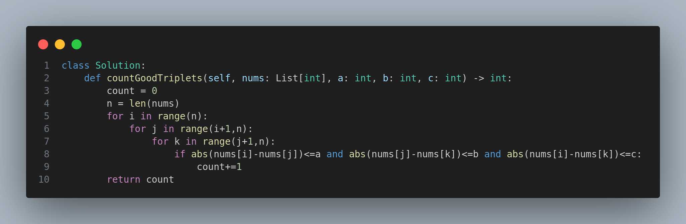

---

# 1534. Count Good Triplets

## Problem Statement

You are given an array of integers `arr`, and three integers `a`, `b`, and `c`.

Your task is to find the **number of good triplets**.

A triplet `(arr[i], arr[j], arr[k])` is considered **good** if the following conditions are met:

1. `0 <= i < j < k < arr.length`
2. `|arr[i] - arr[j]| <= a`
3. `|arr[j] - arr[k]| <= b`
4. `|arr[i] - arr[k]| <= c`

Where `|x|` denotes the absolute value of `x`.

---

## Constraints

- `3 <= arr.length <= 100`
- `0 <= arr[i] <= 1000`
- `0 <= a, b, c <= 1000`

---

## Examples

### Example 1:
**Input:**
- `arr = [3,0,1,1,9,7]`
- `a = 7`, `b = 2`, `c = 3`

**Output:** `4`

**Explanation:**
There are 4 good triplets:
- `(3, 0, 1)`
- `(3, 0, 1)`
- `(3, 1, 1)`
- `(0, 1, 1)`

### Example 2:
**Input:**
- `arr = [1,1,2,2,3]`
- `a = 0`, `b = 0`, `c = 1`

**Output:** `0`

**Explanation:**
No triplet satisfies all conditions.

---

## Approach

1. Use a **triple nested loop** to iterate through all possible combinations `(i, j, k)` where `i < j < k`.
2. For each triplet, check the conditions:
   - `|arr[i] - arr[j]| <= a`
   - `|arr[j] - arr[k]| <= b`
   - `|arr[i] - arr[k]| <= c`
3. If all conditions are met, count it as a good triplet.

This approach works well within the given constraints (array length up to 100).

---

## Code

The implementation is shown in the image below:

---

