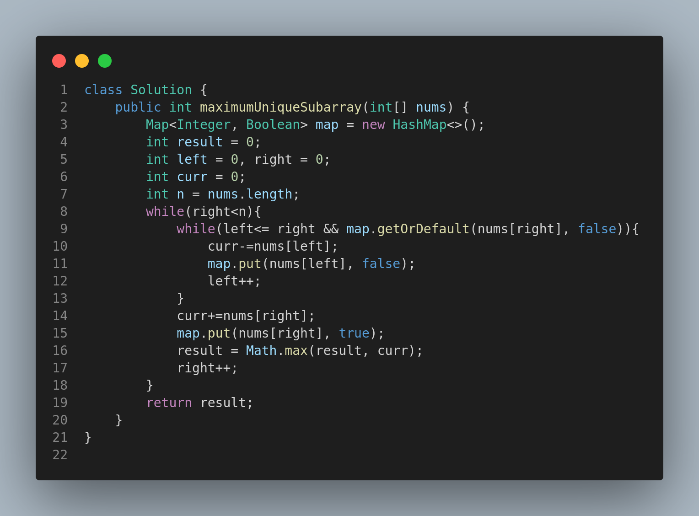

# 1695. Maximum Erasure Value

## Problem Statement

You are given an array of **positive integers** `nums` and want to erase a subarray containing **unique elements**. The score you get by erasing the subarray is equal to the **sum of its elements**.

Return the **maximum score** you can get by erasing exactly one subarray.

A subarray is a contiguous part of an array.

---

## Examples

### Example 1:

**Input:**

```
nums = [4,2,4,5,6]
```

**Output:**

```
17
```

**Explanation:** The optimal subarray is \[2,4,5,6] with a total sum of 17.

---

### Example 2:

**Input:**

```
nums = [5,2,1,2,5,2,1,2,5]
```

**Output:**

```
8
```

**Explanation:** The optimal subarray is \[5,2,1] or \[1,2,5], both yielding a score of 8.

---

## Constraints

* `1 <= nums.length <= 10^5`
* `1 <= nums[i] <= 10^4`

---

## Approach

We use a **sliding window** technique along with a **HashMap** to maintain a window of unique elements:

1. Initialize two pointers `left` and `right` to 0.
2. Use a `Map` to keep track of elements in the current window.
3. Use a variable `curr` to keep track of the current sum of the subarray.
4. Expand the window to the right as long as elements are unique.
5. If a duplicate is found, shrink the window from the left until the duplicate is removed.
6. At each step, update the `result` with the maximum value of `curr`.

This ensures the subarray always contains unique elements and the sum is maximized.

---

## Code Implementation (Java)



---

## Summary

* Utilizes **sliding window + HashMap** for optimal performance.
* Maintains **unique elements** in the window.
* Time Complexity: **O(N)**
* Space Complexity: **O(N)**

---
