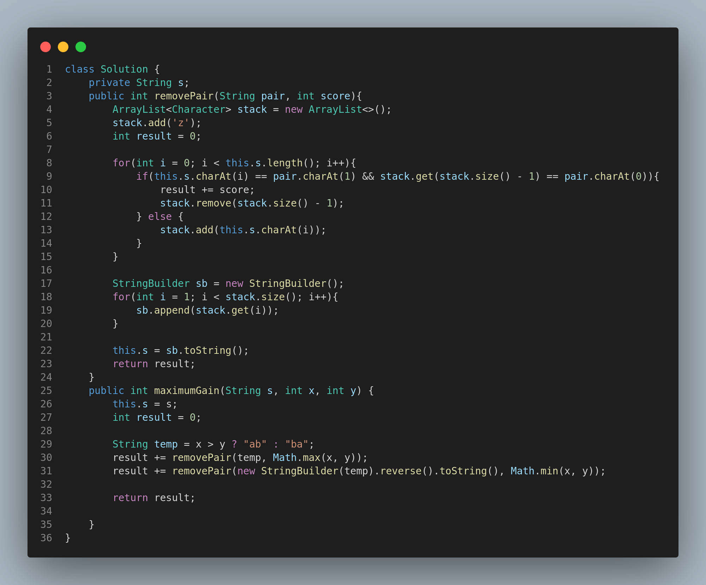

# 1717. Maximum Score From Removing Substrings

## Problem Statement

You are given a string `s` and two integers `x` and `y`. You can perform two types of operations any number of times:

* Remove substring **"ab"** and gain **x** points.
* Remove substring **"ba"** and gain **y** points.

Return the **maximum points** you can gain after applying the above operations on `s`.

---

## Examples

### Example 1:

**Input:**

```
s = "cdbcbbaaabab", x = 4, y = 5
```

**Output:**

```
19
```

**Explanation:**

* Remove the "ba" in "cdbcbbaaabab" → "cdbcbbaaab", gain 5 points
* Remove the "ab" in "cdbcbbaaab" → "cdbcbbaa", gain 4 points
* Remove the "ba" in "cdbcbbaa" → "cdbcba", gain 5 points
* Remove the "ba" in "cdbcba" → "cdbc", gain 5 points

**Total Score:** 5 + 4 + 5 + 5 = 19

---

### Example 2:

**Input:**

```
s = "aabbaaxybbaabb", x = 5, y = 4
```

**Output:**

```
20
```

---

## Constraints

* `1 <= s.length <= 10^5`
* `1 <= x, y <= 10^4`
* `s` consists of lowercase English letters.

---

## Approach

We use a **greedy stack-based approach**:

1. The goal is to always remove the higher-scoring pair first.
2. We define a helper method `removePair(String pair, int score)` to remove the given pair from the string while calculating the gained score.
3. In the main method, compare `x` and `y` to determine which pair to remove first:

   * If `x > y`, remove all "ab" first, then "ba"
   * If `y > x`, remove all "ba" first, then "ab"

This ensures we gain the maximum score by giving priority to the higher-valued operation.

---

## Code Implementation (Java)



---

## Summary

* Uses a **greedy + stack** strategy.
* Removes higher-score substrings first to maximize points.
* Time Complexity: **O(N)**
* Space Complexity: **O(N)**

---
