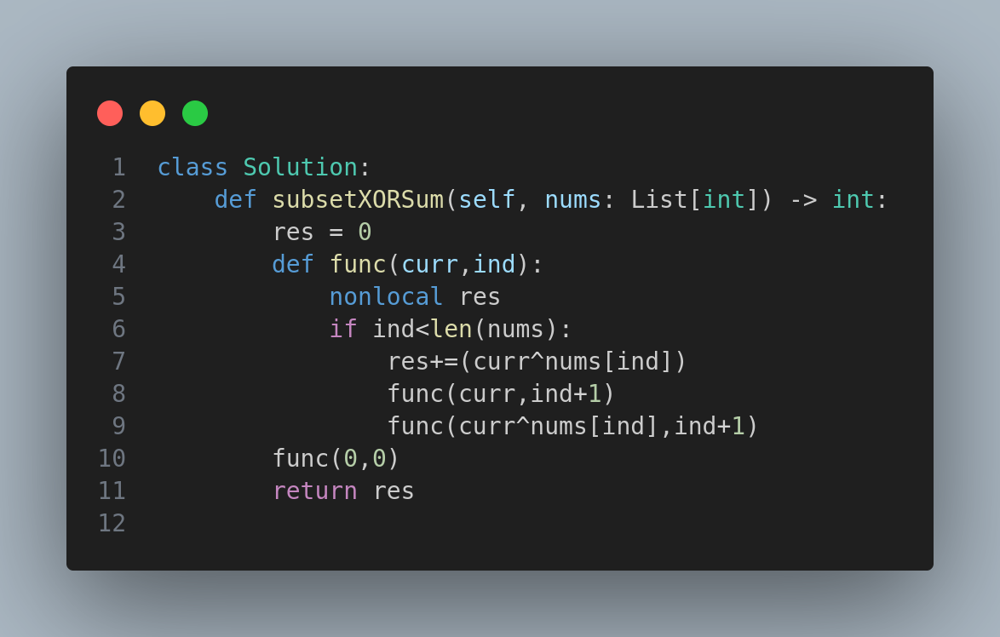

# 1863. Sum of All Subset XOR Totals

## Problem Statement

The XOR total of an array is defined as the bitwise XOR of all its elements, or 0 if the array is empty.

You're given an integer array `nums`. Return the **sum of all XOR totals** for every subset of `nums`.

### Note:

- Subsets with the same elements but in different order are counted **multiple times**.
- An array `a` is a subset of an array `b` if `a` can be obtained from `b` by deleting some (possibly zero) elements.

---

## Examples

### Example 1:

**Input:** `nums = [1, 3]`

**Output:** `6`

**Explanation:**
Subsets:

- [] => XOR = 0
- [1] => XOR = 1
- [3] => XOR = 3
- [1,3] => XOR = 1 ^ 3 = 2

Sum = 0 + 1 + 3 + 2 = **6**

### Example 2:

**Input:** `nums = [5,1,6]`

**Output:** `28`

**Explanation:**
All subsets and their XOR totals:

- [] => 0
- [5] => 5
- [1] => 1
- [6] => 6
- [5,1] => 4
- [5,6] => 3
- [1,6] => 7
- [5,1,6] => 2

Sum = 0 + 5 + 1 + 6 + 4 + 3 + 7 + 2 = **28**

### Example 3:

**Input:** `nums = [3,4,5,6,7,8]`

**Output:** `480`

---

## Constraints

- `1 <= nums.length <= 12`
- `1 <= nums[i] <= 20`

---

## Approach

We use **backtracking** (recursive DFS) to explore all subsets of the array.

- At each recursive call, we decide whether to **include** or **exclude** the current element in the XOR operation.
- We maintain a running XOR (`curr`) and an index (`ind`) as we traverse the array.
- The XOR of each valid subset is added to a running total `res`.

---

## Code

---

## Complexity Analysis

- **Time Complexity:** O(2^n), where `n` is the length of `nums`. This is due to exploring all possible subsets.
- **Space Complexity:** O(n) for the recursion stack.

---

📌 **Tip:** XOR is both associative and commutative, which makes it perfect for bitwise operations on subsets.

---

🧠 *This is a classic example of using backtracking to explore combinatorial space efficiently!*

