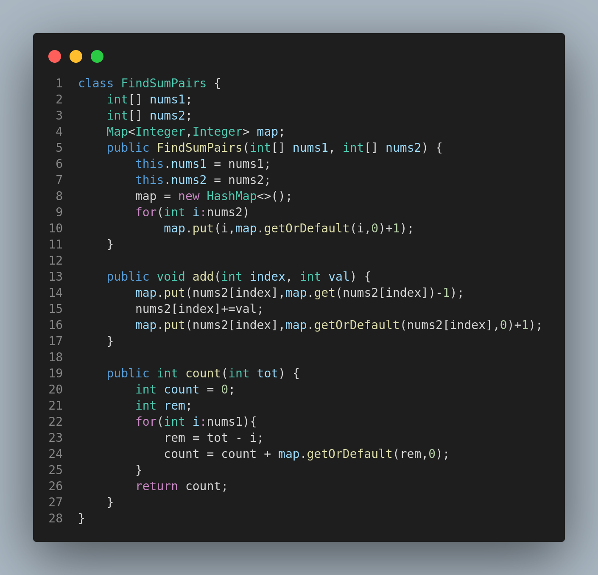

# 1865. Finding Pairs With a Certain Sum

## Problem Statement

You are given two integer arrays `nums1` and `nums2`. You are tasked to implement a data structure that supports queries of two types:

1. Add a positive integer to an element of a given index in the array `nums2`.
2. Count the number of pairs `(i, j)` such that `nums1[i] + nums2[j]` equals a given value (`0 <= i < nums1.length` and `0 <= j < nums2.length`).

### Implement the `FindSumPairs` class:

* `FindSumPairs(int[] nums1, int[] nums2)` Initializes the object with the arrays.
* `void add(int index, int val)` Increments `nums2[index]` by `val`.
* `int count(int tot)` Returns the number of pairs `(i, j)` such that `nums1[i] + nums2[j] == tot`.

---

## Examples

**Input:**

```
["FindSumPairs", "count", "add", "count", "count", "add", "add", "count"]
[[[1,1,2,2,2,3], [1,4,5,2,5,4]], [7], [3,2], [8], [4], [0,1], [1,1], [7]]
```

**Output:**

```
[null, 8, null, 2, 1, null, null, 11]
```

**Explanation:**

```java
FindSumPairs findSumPairs = new FindSumPairs([1,1,2,2,2,3], [1,4,5,2,5,4]);
findSumPairs.count(7);  // return 8
findSumPairs.add(3, 2); // now nums2 = [1,4,5,4,5,4]
findSumPairs.count(8);  // return 2
findSumPairs.count(4);  // return 1
findSumPairs.add(0, 1); // now nums2 = [2,4,5,4,5,4]
findSumPairs.add(1, 1); // now nums2 = [2,5,5,4,5,4]
findSumPairs.count(7);  // return 11
```

---

## Constraints

* `1 <= nums1.length <= 1000`
* `1 <= nums2.length <= 10^5`
* `1 <= nums1[i] <= 10^9`
* `1 <= nums2[i] <= 10^5`
* `0 <= index < nums2.length`
* `1 <= val <= 10^5`
* `1 <= tot <= 10^9`
* At most 1000 calls are made to `add` and `count` each

---

## Approach

* Store the frequencies of `nums2` in a hashmap to optimize the count operation.
* On `add()`, update the hashmap accordingly.
* On `count()`, for each element in `nums1`, find how many `nums2[j] = tot - nums1[i]` exist using the hashmap.

---

## Code Representation



---

## Summary

* Efficient data structure usage with `HashMap`.
* Supports dynamic updates with fast lookup.
* Great example of balancing frequency maps with data mutation operations.

---
