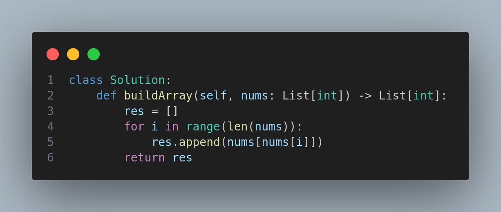

# Build Array from Permutation



## Problem Description

**Leetcode Problem 1920: Build Array from Permutation**

Given a **zero-based permutation** `nums` (0-indexed), your task is to build an array `ans` of the same length where:

```
ans[i] = nums[nums[i]]
```

Return the array `ans`.

A zero-based permutation `nums` is an array of **distinct integers** from `0` to `nums.length - 1` (inclusive).

---

## Example 1

* **Input:** `nums = [0,2,1,5,3,4]`
* **Output:** `[0,1,2,4,5,3]`
* **Explanation:**

  * `ans = [nums[0], nums[2], nums[1], nums[5], nums[3], nums[4]]`
  * `ans = [0, 1, 2, 4, 5, 3]`

## Example 2

* **Input:** `nums = [5,0,1,2,3,4]`
* **Output:** `[4,5,0,1,2,3]`

---

## Constraints

* `1 <= nums.length <= 1000`
* `0 <= nums[i] < nums.length`
* The elements in `nums` are **distinct**.

---

## Follow-Up

**Can you solve it without using extra space (i.e., O(1) memory)?**

---

## Tags

`Array`, `Simulation`

## Difficulty

**Easy**

---

## Companies

This problem is frequently asked by top tech companies and is a great starting point for array manipulation challenges.
