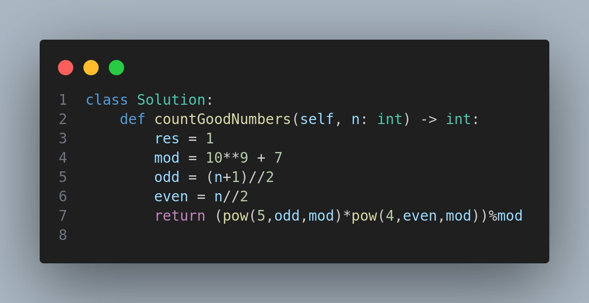

# 1922. Count Good Numbers

## Problem Statement 

A digit string is considered **good** if:

- The digits at **even indices** (0-based) are **even** (0, 2, 4, 6, 8).
- The digits at **odd indices** are **prime** (2, 3, 5, 7).

You are given an integer `n`, which represents the length of the digit string. Return the **total number of good digit strings** of length `n` modulo \( 10^9 + 7 \).

---

## Constraints

- \( 1 \leq n \leq 10^{15} \)

---

## Examples

### Example 1:
**Input:** `n = 1`

**Output:** `5`

**Explanation:** The good numbers of length 1 are "0", "2", "4", "6", "8".

---

### Example 2:
**Input:** `n = 4`

**Output:** `400`

---

### Example 3:
**Input:** `n = 50`

**Output:** `564908303`

---

## Approach

We use modular exponentiation to compute the total combinations:

- There are 5 even digits that can appear at even indices: [0, 2, 4, 6, 8].
- There are 4 prime digits that can appear at odd indices: [2, 3, 5, 7].

Let:
- `odd = (n + 1) // 2` → count of even-indexed positions
- `even = n // 2` → count of odd-indexed positions

The total good strings = \( 5^{\text{odd}} \times 4^{\text{even}} \mod (10^9 + 7) \)

---

## Code

