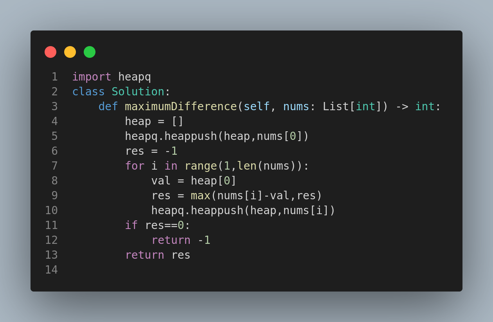

# 2016. Maximum Difference Between Increasing Elements

## Problem Statement

Given a **0-indexed** integer array `nums` of size `n`, find the **maximum difference** between `nums[i]` and `nums[j]` (i.e., `nums[j] - nums[i]`), such that:

* `0 <= i < j < n`
* `nums[i] < nums[j]`

Return the **maximum difference**. If no such `i` and `j` exist, return `-1`.

---

## Examples

### Example 1:

**Input:**

```
nums = [7,1,5,4]
```

**Output:**

```
4
```

**Explanation:**

* Maximum difference is `5 - 1 = 4` with `i = 1`, `j = 2`.

### Example 2:

**Input:**

```
nums = [9,4,3,2]
```

**Output:**

```
-1
```

**Explanation:**

* No valid pair where `nums[i] < nums[j]` and `i < j`.

### Example 3:

**Input:**

```
nums = [1,5,2,10]
```

**Output:**

```
9
```

**Explanation:**

* Maximum difference is `10 - 1 = 9` with `i = 0`, `j = 3`.

---

## Constraints

* `n == nums.length`
* `2 <= n <= 1000`
* `1 <= nums[i] <= 10^9`

---

## Approach

1. Use a min-heap to track the minimum value seen so far.
2. Iterate from left to right and compute the difference with the minimum value.
3. If the condition `nums[i] < nums[j]` is not satisfied anywhere, return `-1`.

---

## Visual Reference



---

## Summary

* A great example of using heaps or prefix minima to find valid increasing pairs.
* Pay close attention to index conditions (`i < j`) and value order (`nums[i] < nums[j]`).

 Useful for understanding how to apply heaps or linear scans to track minimums in arrays.
