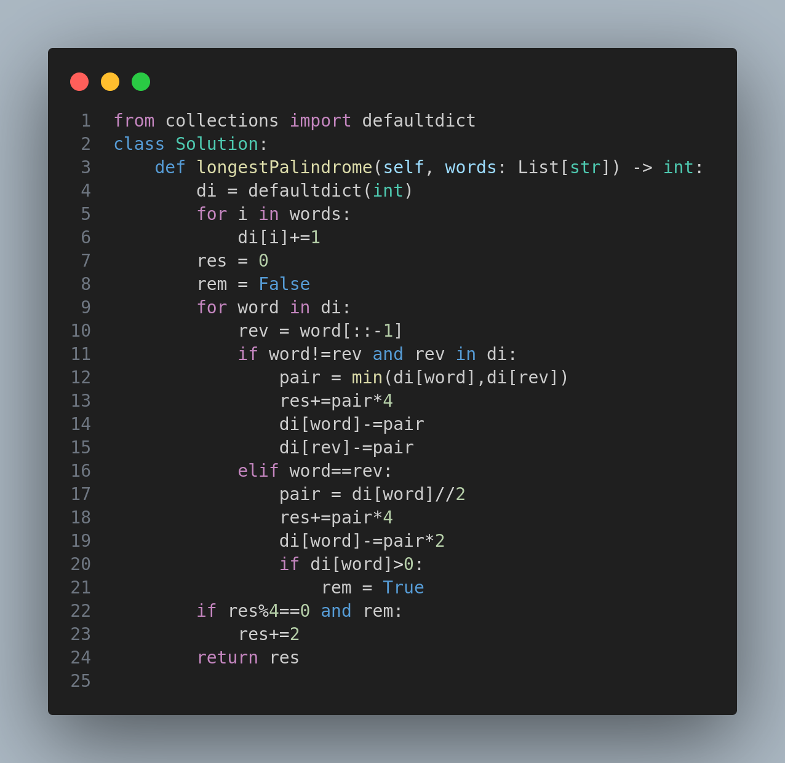

# Longest Palindrome by Concatenating Two Letter Words

### Problem Statement

You are given an array of strings `words`, where each string is a two-letter lowercase word. Your task is to form the **longest palindrome** possible by selecting and concatenating some of these words. Each word can be used **at most once**.

A **palindrome** is a string that reads the same forward and backward.

### Examples

* **Input:** `words = ["lc","cl","gg"]`

  * **Output:** `6`
  * **Explanation:** One palindrome is `"lcggcl"`

* **Input:** `words = ["ab","ty","yt","lc","cl","ab"]`

  * **Output:** `8`
  * **Explanation:** One palindrome is `"tylcclyt"`

* **Input:** `words = ["cc","ll","xx"]`

  * **Output:** `2`
  * **Explanation:** Any one symmetric word can form a 2-letter palindrome.

---

### Approach

To solve this, we need to consider two kinds of word pairs:

#### 1. **Mirror Pairs (e.g., "ab" and "ba")**

* These words can be placed symmetrically around the center.
* For each pair, we can add 4 characters to the result.

#### 2. **Symmetric Words (e.g., "gg", "cc")**

* These are naturally palindromic.
* We can use them in pairs (each pair adds 4 characters).
* At most one unpaired symmetric word can be placed at the center (adds 2 characters).

---

### Steps:

1. Count occurrences of each word.
2. For each asymmetric word, match it with its reverse to maximize palindrome length.
3. For symmetric words, use as many pairs as possible.
4. If any symmetric word remains, use **one** in the center.

---

### Visual Explanation

---

### Time and Space Complexity

* **Time Complexity:** O(N), where N is the number of words.
* **Space Complexity:** O(N), for the hashmap storing word frequencies.

---

### Constraints

* `1 <= words.length <= 10^5`
* Each `word.length == 2`
* Each word contains only lowercase English letters.

---

