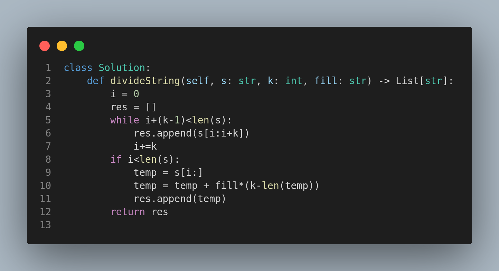

# 2138. Divide a String Into Groups of Size k

## 🧩 Problem Statement

Given a string `s`, an integer `k`, and a character `fill`, divide the string into groups of size `k`.

* Each group should contain exactly `k` characters.
* If the last group has fewer than `k` characters, append the `fill` character until the group is of size `k`.
* Return the list of string groups.

---

## 🧪 Examples

### Example 1

**Input:**

```text
s = "abcdefghi", k = 3, fill = "x"
```

**Output:**

```text
["abc", "def", "ghi"]
```

**Explanation:** All groups are filled completely, no `fill` character is needed.

---

### Example 2

**Input:**

```text
s = "abcdefghij", k = 3, fill = "x"
```

**Output:**

```text
["abc", "def", "ghi", "jxx"]
```

**Explanation:** Last group `"j"` is padded with `"xx"` to make it `"jxx"`.

---

## 📚 Constraints

* `1 <= s.length <= 100`
* `s` consists of lowercase English letters.
* `fill` is a single lowercase English letter.

---

## 🧠 Approach

1. Start from the beginning of the string and collect substrings of size `k`.
2. If the last group has fewer than `k` characters, pad it with the `fill` character.
3. Append each group to a result list and return it.

---

## ✅ Key Concepts

* String slicing
* Padding with fill character
* Loop with step size `k`

---

## 📷 Code Representation



---

## 🏁 Summary

This problem helps you get comfortable with:

* **String partitioning**
* **Edge-case handling** (like incomplete final groups)
* **List construction with fixed-size grouping**

