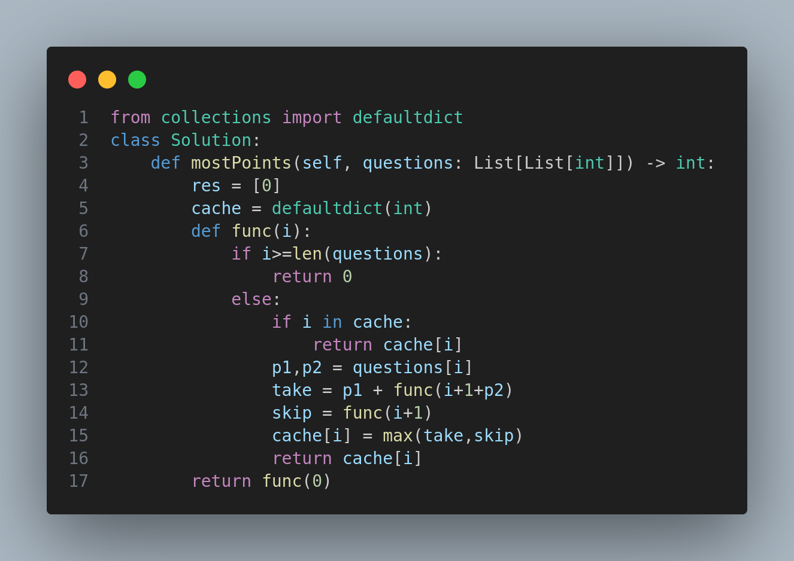

# Most Points Problem - Solution Explanation

## Problem Statement
Given a list of questions, where each question is represented as `[points, brainpower]`, you must determine the maximum number of points you can earn. If you choose to answer a question at index `i`, you gain `points[i]` but must skip the next `brainpower[i]` questions before attempting another.

## Approach
This solution employs **recursion with memoization** (using `defaultdict`) to efficiently compute the maximum points possible.

## Code Explanation
<p align="center">
  
</p> 

## Explanation of Key Concepts
- **Recursion**: The function `func(i)` determines the maximum points achievable from index `i` onward.
- **Memoization (Caching with `defaultdict`)**:
  - The `cache` dictionary stores results of previously computed indices.
  - If `i` has already been computed, we return `cache[i]` directly, avoiding redundant calculations.
- **Decision Making**:
  - `take`: If the current question is answered, the next `p2` questions are skipped.
  - `skip`: If the current question is skipped, move to `i+1`.
  - Store the max value of these two choices in `cache[i]`.

## Complexity Analysis
- **Time Complexity**: `O(n)`
  - Each index `i` is computed **once** and stored in `cache`, reducing repeated calculations.
- **Space Complexity**: `O(n)`
  - Due to the recursion stack and `cache` dictionary storing results.

## Example Walkthrough
### **Input**:
```python
questions = [[3, 2], [4, 3], [2, 2], [6, 4], [5, 3]]
sol = Solution()
print(sol.mostPoints(questions))
```
### **Breakdown**:
1. Start at index `0`.
2. Consider taking question `0` (gain `3` points, move to index `3`) or skipping it (move to `1`).
3. Repeat for all possible choices.
4. Cache results to avoid recomputation.

### **Output**:
```python
9  # Maximum points possible
```

## Summary
This approach efficiently determines the maximum points you can earn by leveraging **recursion and memoization with a defaultdict**. 🚀
