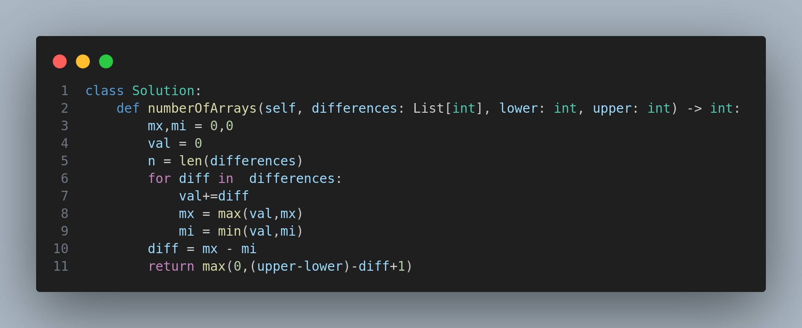

# 2145. Count the Hidden Sequences

## Problem Description

You are given a 0-indexed array of integers `differences` of length `n`, which describes the differences between each pair of consecutive integers of a hidden sequence of length `(n + 1)`. More formally, call the hidden sequence `hidden`, then:

```
differences[i] = hidden[i + 1] - hidden[i]
```

You are also given two integers `lower` and `upper` that describe the inclusive range `[lower, upper]` of possible values that the hidden sequence can contain.

Your task is to determine the number of possible hidden sequences that satisfy both the difference constraints and the value range.

Return the number of such possible sequences. If there are no valid sequences, return `0`.

---

## Examples

### Example 1:

**Input:**

```python
differences = [1, -3, 4]
lower = 1
upper = 6
```

**Output:**

```
2
```

**Explanation:**
The valid sequences include:

- [3, 4, 1, 5]
- [4, 5, 2, 6]

### Example 2:

**Input:**

```python
differences = [3, -4, 5, 1, -2]
lower = -4
upper = 5
```

**Output:**

```
4
```

**Explanation:**
Possible sequences include:

- [-3, 0, -4, 1, 2, 0]
- [-2, 1, -3, 2, 3, 1]
- [-1, 2, -2, 3, 4, 2]
- [0, 3, -1, 4, 5, 3]

### Example 3:

**Input:**

```python
differences = [4, -7, 2]
lower = 3
upper = 6
```

**Output:**

```
0
```

**Explanation:**
No sequence can satisfy the given conditions.

---

## Constraints

- `1 <= differences.length <= 10^5`
- `-10^5 <= differences[i] <= 10^5`
- `-10^5 <= lower <= upper <= 10^5`

---

## Code



---

## Intuition and Explanation

- We aim to find how much the values in the hidden sequence can vary based on the differences.
- We simulate the prefix sum to track the running total `val` which gives us the relative changes from the starting number.
- The maximum possible span of values the hidden sequence can take is `(upper - lower + 1)`.
- If the fluctuation in prefix sums exceeds this span, no sequence is valid.
- Otherwise, we calculate how many values the starting number can take such that all subsequent values fall within bounds.

---

## Time Complexity

- **O(n)** where `n` is the length of the `differences` array.

---

## Space Complexity

- **O(1)** additional space.

---

## Tags

- Array
- Prefix Sum
- Math

