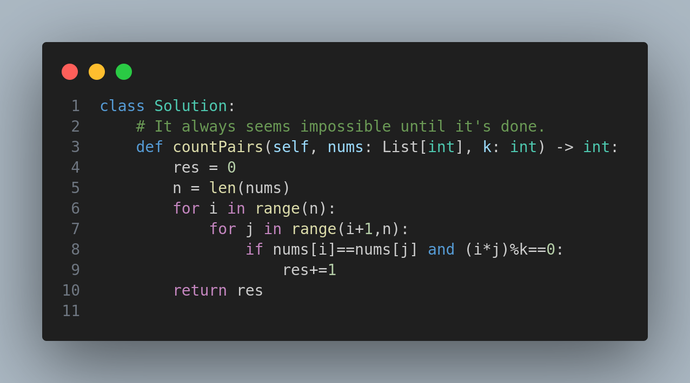

# 2176. Count Equal and Divisible Pairs in an Array

## Problem Statement

Given a 0-indexed integer array `nums` of length `n` and an integer `k`, return the number of pairs `(i, j)` where `0 <= i < j < n`, such that:

- `nums[i] == nums[j]`, and
- `(i * j)` is divisible by `k`.

---

## Examples

### Example 1:
**Input:** `nums = [3,1,2,2,2,1,3]`, `k = 2`  
**Output:** `4`  
**Explanation:**
There are 4 valid pairs:
- `(0, 6)`: 3 == 3 and 0 * 6 = 0 (divisible by 2)
- `(2, 3)`: 2 == 2 and 2 * 3 = 6 (divisible by 2)
- `(2, 4)`: 2 == 2 and 2 * 4 = 8 (divisible by 2)
- `(3, 4)`: 2 == 2 and 3 * 4 = 12 (divisible by 2)

### Example 2:
**Input:** `nums = [1,2,3,4]`, `k = 1`  
**Output:** `0`  
**Explanation:** No repeated numbers, so no valid pairs.

---

## Constraints

- `1 <= nums.length <= 100`
- `1 <= nums[i], k <= 100`

---

## Approach

The algorithm performs a brute-force comparison between all pairs `(i, j)` such that `i < j`.

For each pair:
1. Check if `nums[i] == nums[j]`.
2. Check if `(i * j) % k == 0`.

If both conditions hold, the pair is counted as valid.

This approach works well within the constraint limits (`n <= 100`).

---

## Code

