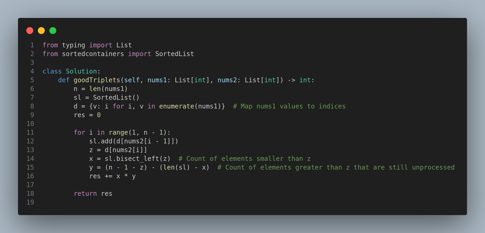

# 2179. Count Good Triplets in an Array

## Problem Statement

You are given two 0-indexed arrays `nums1` and `nums2` of length `n`, both of which are **permutations** of `[0, 1, ..., n - 1]`.

A **good triplet** is a set of 3 **distinct values** that are present in **increasing order** by position both in `nums1` and `nums2`.

Formally, a triplet `(x, y, z)` is good if:
- `pos1x < pos1y < pos1z` and
- `pos2x < pos2y < pos2z`

where `pos1v` and `pos2v` are the indices of value `v` in `nums1` and `nums2`, respectively.

Return the **total number of good triplets**.

---

## Constraints
- `n == nums1.length == nums2.length`
- `3 <= n <= 10^5`
- `0 <= nums1[i], nums2[i] <= n - 1`
- `nums1` and `nums2` are permutations of `[0, 1, ..., n - 1]`

---

## Examples

### Example 1:
**Input:**
```
nums1 = [2,0,1,3]
nums2 = [0,1,2,3]
```
**Output:** `1`

**Explanation:**
Only one good triplet exists: `(0, 1, 3)`.

---

### Example 2:
**Input:**
```
nums1 = [4,0,1,3,2]
nums2 = [4,1,0,2,3]
```
**Output:** `4`

**Explanation:**
The good triplets are: `(4,0,3)`, `(4,0,2)`, `(4,1,3)`, and `(4,1,2)`.

---

## Approach

1. **Map Position:** First, map values in `nums1` to their indices.
2. **Use SortedList:** Use a `SortedList` to maintain the set of values already seen in `nums2` (but referenced through their `nums1` positions).
3. **Process Middle Element:** For each index `i` from `1` to `n-2`:
   - Insert the mapped index of `nums2[i-1]` into the `SortedList`.
   - Count how many indices are **less than** the mapped index of `nums2[i]` (left count).
   - Estimate how many indices are **greater than** it on the right.
   - Multiply the two counts to find the number of good triplets using this as the middle element.
4. **Total Count:** Sum all valid triplets.

This results in an efficient `O(n log n)` solution.

---

## Code



---

