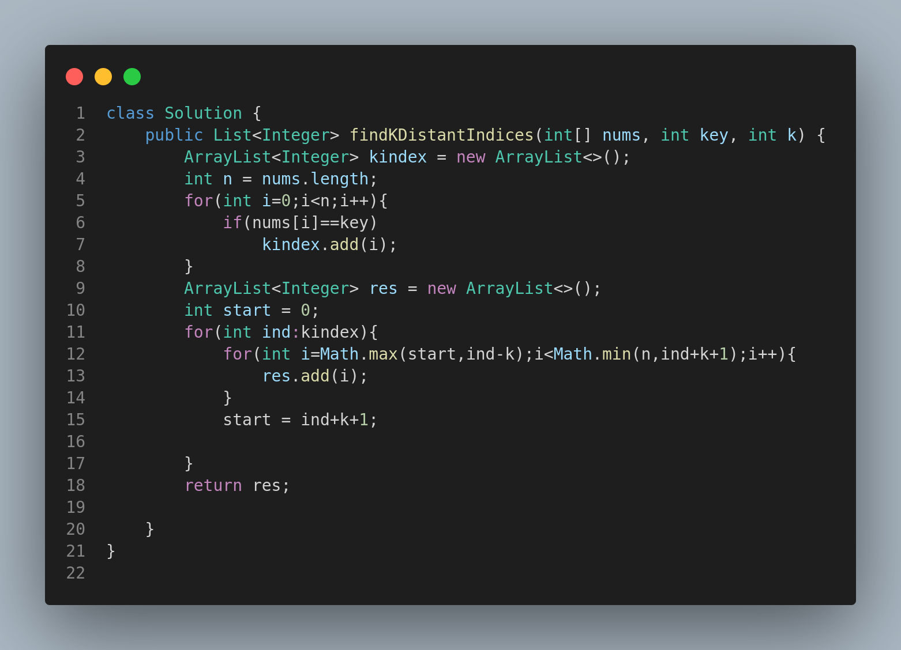

# 2200. Find All K-Distant Indices in an Array

## 🧩 Problem Statement

You are given:

* A 0-indexed integer array `nums`
* An integer `key`
* An integer `k`

Your task is to return all indices `i` in `nums` such that there exists at least one index `j` where:

```
|i - j| <= k AND nums[j] == key
```

These are called **k-distant indices**.

Return the **list of all k-distant indices** in **increasing order**.

---

## 🧪 Examples

### Example 1

**Input:**

```text
nums = [3,4,9,1,3,9,5]
key = 9
k = 1
```

**Output:**

```text
[1,2,3,4,5,6]
```

**Explanation:**

* `nums[2]` and `nums[5]` are equal to the `key` (9).
* Any index within distance 1 from 2 or 5 is a valid k-distant index.
* These indices are: 1, 2, 3 (around index 2), and 4, 5, 6 (around index 5).

---

### Example 2

**Input:**

```text
nums = [2,2,2,2,2]
key = 2
k = 2
```

**Output:**

```text
[0,1,2,3,4]
```

**Explanation:**

* Every element is equal to the key, and with k=2, all indices are within range of each other.
* So, all indices are valid k-distant indices.

---

## 📚 Constraints

* `1 <= nums.length <= 1000`
* `1 <= nums[i] <= 1000`
* `key` is a value present in `nums`
* `1 <= k <= nums.length`

---

## 🧠 Approach

1. First, collect all indices `j` where `nums[j] == key`.
2. For each such index `j`, include all `i` such that `|i - j| <= k`.
3. Use a sliding window to avoid duplicates and to efficiently update the range.
4. Use a set or handle overlaps carefully if needed (this version handles overlaps via index control).

---

## 📷 Code Illustration



---

## ✅ Key Concepts

* Array traversal
* Sliding window or interval overlap
* Distance calculation using absolute difference

---

## 🏁 Summary

This problem tests your ability to:

* Work with array indices
* Apply range-based inclusion logic
* Handle edge cases and overlaps cleanly

Useful for practice with nested loops and range-based search optimizations.
