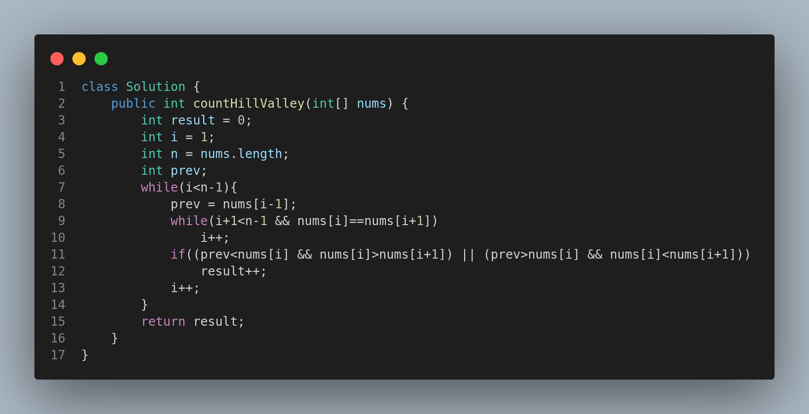

# 🏞️ Leetcode 2210: Count Hills and Valleys in an Array

## 📘 Problem Statement

You are given a 0-indexed integer array `nums`. An index `i` is part of a **hill** in `nums` if the closest non-equal neighbors of `i` are **smaller** than `nums[i]`.  
Similarly, an index `i` is part of a **valley** if the closest non-equal neighbors of `i` are **larger** than `nums[i]`.

Adjacent indices `i` and `j` are part of the **same hill or valley** if `nums[i] == nums[j]`.

**Return** the number of hills and valleys in `nums`.

---

## 🧪 Examples

### ✅ Example 1:
**Input:** `nums = [2,4,1,1,6,5]`  
**Output:** `3`

**Explanation:**
- Index 1 (4) is a hill (neighbors: 2 and 1).
- Index 2 and 3 (1,1) are valleys (neighbors: 4 and 6).
- Index 4 (6) is a hill (neighbors: 1 and 5).

### ✅ Example 2:
**Input:** `nums = [6,6,5,5,4,1]`  
**Output:** `0`

**Explanation:**
- No valid hill or valley found based on the rules.

---

## 🧠 Approach

1. Traverse from index `1` to `n-2`.
2. Skip duplicates (`nums[i] == nums[i+1]`) to avoid counting the same hill/valley multiple times.
3. Compare current value with previous and next distinct elements:
   - If `nums[i]` is greater than both, it's a **hill**.
   - If `nums[i]` is smaller than both, it's a **valley**.
4. Count such hills and valleys.

---

## 💻 Code

---

## ⏱️ Time & Space Complexity

- **Time Complexity:** `O(n)` — One pass through the array.
- **Space Complexity:** `O(1)` — No extra space used except variables.

---

## 📚 Constraints

- `3 <= nums.length <= 100`
- `1 <= nums[i] <= 100`

---

## 🔗 Related Topics

- Array
- Two Pointers
- Simulation

---

Feel free to replace `image.png` with a code snippet if you're viewing this outside a markdown-supported platform.
