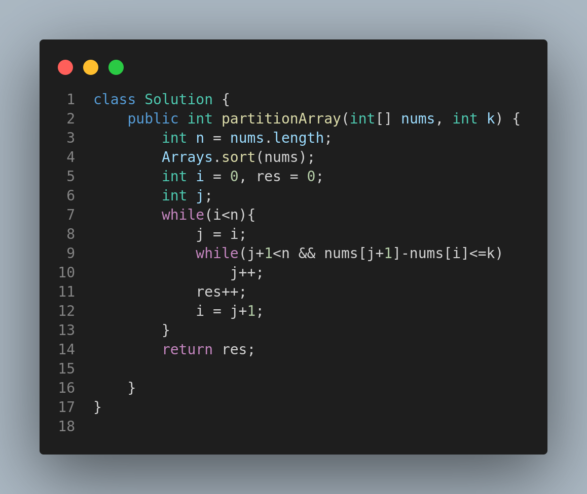

# 2294. Partition Array Such That Maximum Difference Is K

## Problem Statement

You are given an integer array `nums` and an integer `k`. You may partition `nums` into one or more **subsequences** such that each element in `nums` appears in exactly one of the subsequences.

Return the **minimum number of subsequences** needed such that the **difference between the maximum and minimum values** in each subsequence is **at most `k`**.

A subsequence is a sequence that can be derived from another sequence by deleting some or no elements **without changing the order** of the remaining elements.

---

## Examples

### Example 1:

**Input:**

```
nums = [3,6,1,2,5], k = 2
```

**Output:**

```
2
```

**Explanation:**

* Partition into: \[3,1,2] and \[6,5].
* Max - Min in each: 2 and 1.
* Minimum subsequences needed = 2.

### Example 2:

**Input:**

```
nums = [1,2,3], k = 1
```

**Output:**

```
2
```

**Explanation:**

* Partition into: \[1,2] and \[3].
* Another valid solution: \[1] and \[2,3].

### Example 3:

**Input:**

```
nums = [2,2,4,5], k = 0
```

**Output:**

```
3
```

**Explanation:**

* Partition into: \[2,2], \[4], and \[5].
* Max - Min in each group is 0.

---

## Constraints

* `1 <= nums.length <= 10^5`
* `0 <= nums[i] <= 10^5`
* `0 <= k <= 10^5`

---

## Greedy Strategy

1. Sort the array.
2. Use two pointers (`i` and `j`) to scan contiguous chunks of numbers with a max difference ≤ `k`.
3. Every time the difference exceeds `k`, start a new subsequence.

---

## Visual Reference



---

## Summary

* Sorting enables greedy grouping.
* Efficient solution with `O(n log n)` time due to sorting.
* This approach ensures the fewest subsequences satisfying the max-min condition.

This problem is great for understanding greedy partitioning and range-based grouping.
