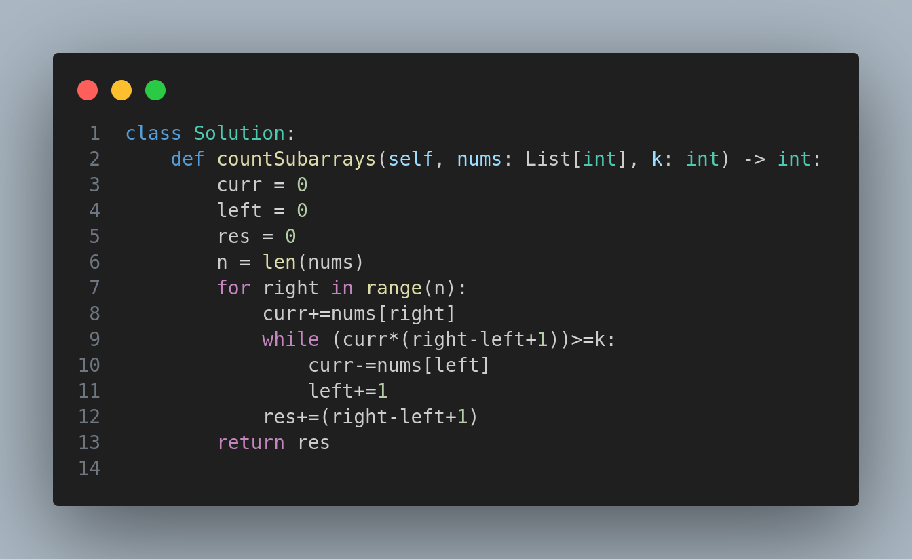

# 2302. Count Subarrays With Score Less Than K

## Problem Statement
The score of an array is defined as the product of its **sum** and its **length**.

For example:
```
Score of [1, 2, 3, 4, 5] = (1 + 2 + 3 + 4 + 5) * 5 = 75
```

You are given a **positive integer array** `nums` and an **integer** `k`.

**Task:**  
Return the number of non-empty subarrays of `nums` whose score is **strictly less than** `k`.

> A subarray is a contiguous sequence of elements within an array.

---

## Example 1
**Input:**  
`nums = [2,1,4,3,5]`  
`k = 10`

**Output:**  
`6`

**Explanation:**
- `[2]` → score = 2 × 1 = 2 ✅
- `[1]` → score = 1 × 1 = 1 ✅
- `[4]` → score = 4 × 1 = 4 ✅
- `[3]` → score = 3 × 1 = 3 ✅
- `[5]` → score = 5 × 1 = 5 ✅
- `[2,1]` → score = (2 + 1) × 2 = 6 ✅

Other subarrays like `[1,4]` and `[4,3,5]` have scores ≥ 10 and are **not valid**.

---

## Example 2
**Input:**  
`nums = [1,1,1]`  
`k = 5`

**Output:**  
`5`

**Explanation:**  
All subarrays except `[1,1,1]` have scores less than 5.

---

## Constraints
- `1 <= nums.length <= 10^5`
- `1 <= nums[i] <= 10^5`
- `1 <= k <= 10^15`

---

## Approach
The solution uses a **sliding window** technique to efficiently count valid subarrays by maintaining a running sum and adjusting the window when necessary.

📷 **Solution Code:**  


