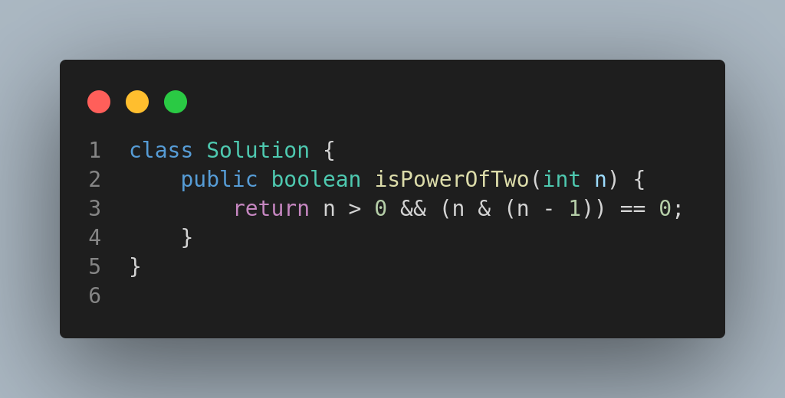

# Power of Two

This project solves the **LeetCode Problem #231: Power of Two**.

## Problem Statement

Given an integer `n`, return `true` if it is a power of two. Otherwise, return `false`.

An integer `n` is a power of two if there exists an integer `x` such that `n == 2^x`.

### Example

**Input:**

```
n = 1
```

**Output:**

```
true
```

Explanation: $2^0 = 1$

**Input:**

```
n = 16
```

**Output:**

```
true
```

Explanation: $2^4 = 16$

**Input:**

```
n = 3
```

**Output:**

```
false
```

## Constraints

* $-2^{31} \leq n \leq 2^{31} - 1$

## Solution

The solution uses **bitwise operations** to determine if `n` is a power of two. If `n` is a power of two, its binary representation contains exactly one `1`.

We check this by using:

```
n > 0 && (n & (n - 1)) == 0
```

## Code Representation



## Follow-Up

This approach avoids loops and recursion, using only a constant time bitwise check.
