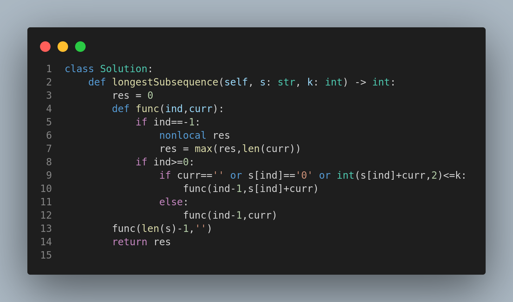

# 2311. Longest Binary Subsequence Less Than or Equal to K

## 🧩 Problem Statement

You are given:

* A binary string `s`
* A positive integer `k`

Your task is to return the **length of the longest subsequence** of `s` that forms a binary number less than or equal to `k`.

### Notes:

* A **subsequence** is formed by deleting zero or more characters **without changing the order**.
* The resulting binary number **can have leading zeroes**.
* The empty string is valid and represents the number `0`.

---

## 🧪 Examples

### Example 1

**Input:**

```text
s = "1001010"
k = 5
```

**Output:** `5`

**Explanation:**

* One possible subsequence is `"00010"` → `2` in decimal.
* Other valid subsequences like `"00100"` → `4` and `"00101"` → `5` also qualify.
* The maximum length among all such valid subsequences is `5`.

---

### Example 2

**Input:**

```text
s = "00101001"
k = 1
```

**Output:** `6`

**Explanation:**

* Longest subsequence: `"000001"` → `1` in decimal.
* Length = 6

---

## 📚 Constraints

* `1 <= s.length <= 1000`
* `s[i]` is either `'0'` or `'1'`
* `1 <= k <= 10^9`

---

## 🧠 Approach

### Intuition:

We aim to **include as many `0`s as possible**, since they don’t significantly increase the binary value. For `1`s, we need to be careful as they rapidly increase the number’s binary value.

### Greedy + Counting:

1. Count all `0`s — they are safe to include.
2. Process `1`s **from right to left** (lowest binary significance to highest).
3. Add each `1` to the result only if it keeps the binary value ≤ `k`.

---

## ✅ Key Concepts

* **Binary representation**
* **Subsequence generation**
* **Greedy selection based on value growth**
* Optimizing for **length**, not value

---

## 📷 Code Illustration



> 🖼️ The image above visually represents the recursive/backtracking decision process of choosing `0`s and selective `1`s based on binary magnitude.

---

## 🏁 Summary

This problem combines:

* Subsequence selection
* Binary number understanding
* Greedy strategy


