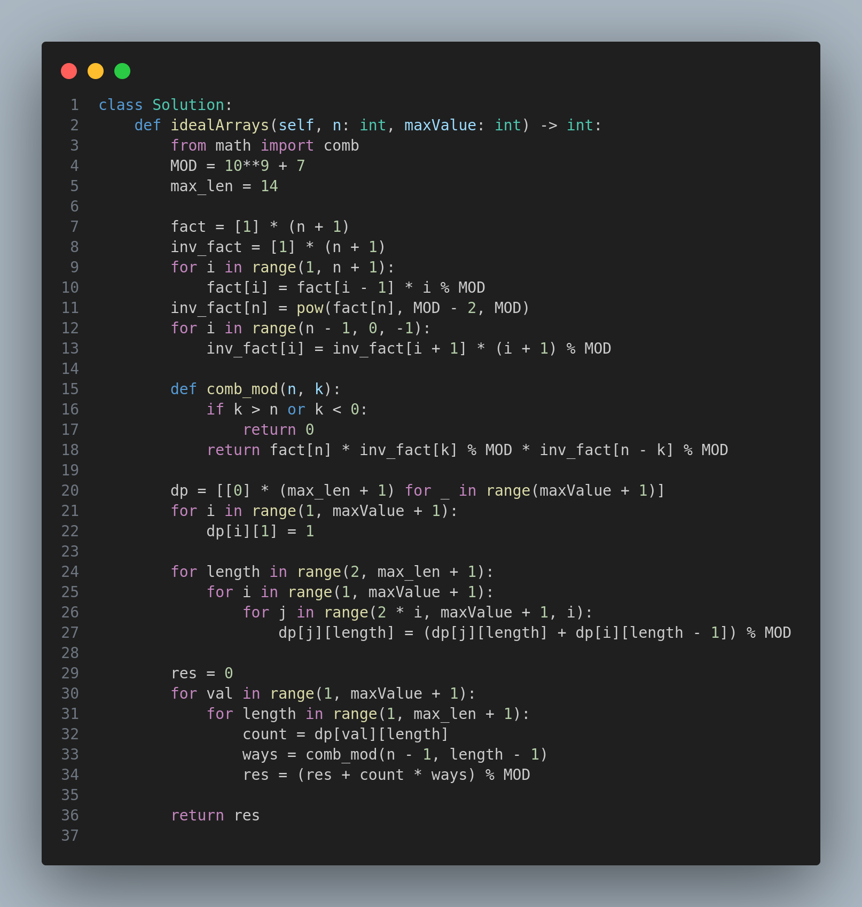

# 2338. Count the Number of Ideal Arrays

## Problem Description

You are given two integers `n` and `maxValue`, which define an ideal array.

A 0-indexed integer array `arr` of length `n` is considered **ideal** if:
- Every `arr[i]` is a value from `1` to `maxValue`, for `0 <= i < n`.
- Every `arr[i]` is divisible by `arr[i - 1]`, for `0 < i < n`.

Return the number of distinct ideal arrays of length `n`. Since the answer may be very large, return it modulo `10^9 + 7`.

---

## Examples

### Example 1:

**Input:**
```
n = 2
maxValue = 5
```

**Output:**
```
10
```

**Explanation:**
The possible ideal arrays include:
- Arrays starting with 1 (5): [1,1], [1,2], [1,3], [1,4], [1,5]
- Arrays starting with 2 (2): [2,2], [2,4]
- Arrays starting with 3 (1): [3,3]
- Arrays starting with 4 (1): [4,4]
- Arrays starting with 5 (1): [5,5]

Total: 5 + 2 + 1 + 1 + 1 = 10

### Example 2:

**Input:**
```
n = 5
maxValue = 3
```

**Output:**
```
11
```

**Explanation:**
The ideal arrays include:
- Arrays starting with 1 (9):
  - All 1s (1): [1,1,1,1,1]
  - With 2 as second value (4): [1,1,1,1,2], [1,1,1,2,2], [1,1,2,2,2], [1,2,2,2,2]
  - With 3 as second value (4): [1,1,1,1,3], [1,1,1,3,3], [1,1,3,3,3], [1,3,3,3,3]
- Arrays starting with 2 (1): [2,2,2,2,2]
- Arrays starting with 3 (1): [3,3,3,3,3]

Total: 9 + 1 + 1 = 11

---

## Constraints

- `2 <= n <= 10^4`
- `1 <= maxValue <= 10^4`

---

## Solution



---

## Intuition and Explanation

- An ideal array is constructed by repeatedly multiplying or staying the same. We build sequences from smaller values and extend them.
- The key is dynamic programming based on divisibility and combinatorics.
- For each length and value, compute how many valid sequences end with that value.
- Use combinations to count how these sequences can be distributed over the array of length `n`.

---

## Time Complexity
- **O(n log n)** (approximate due to nested loops and divisor steps)

---

## Tags
- Dynamic Programming
- Combinatorics
- Math
