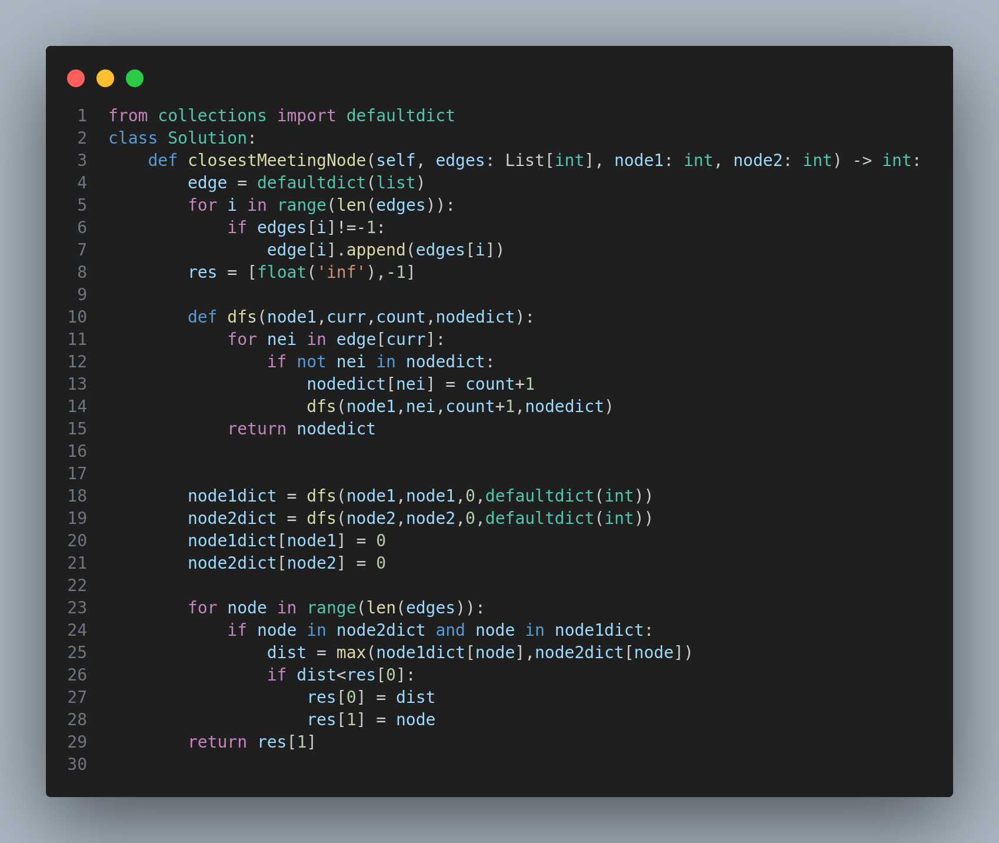

# Closest Meeting Node

## Problem Description

You are given a **directed graph** with `n` nodes (labeled from `0` to `n - 1`), where each node has **at most one outgoing edge**. The graph is represented using a 0-indexed integer array `edges` of size `n`, where `edges[i]` indicates there is a directed edge from node `i` to `edges[i]`. If there is no outgoing edge, then `edges[i] == -1`.

Given two nodes `node1` and `node2`, return the **index of the node** that can be reached from **both** nodes such that the **maximum** of the distances from `node1` and `node2` to that node is **minimized**. If there are multiple answers, return the node with the smallest index. If no such node exists, return `-1`.

---

## Example 1

**Input:**

```
edges = [2,2,3,-1], node1 = 0, node2 = 1
```

**Output:**

```
2
```

**Explanation:**

* Distance from node 0 to 2 is 1
* Distance from node 1 to 2 is 1
* The maximum is 1, which is minimal.

---

## Example 2

**Input:**

```
edges = [1,2,-1], node1 = 0, node2 = 2
```

**Output:**

```
2
```

**Explanation:**

* Distance from node 0 to 2 is 2
* Distance from node 2 to 2 is 0
* The maximum is 2, which is minimal.

---

## Constraints

* `n == edges.length`
* `2 <= n <= 10^5`
* `-1 <= edges[i] < n`
* `edges[i] != i`
* `0 <= node1, node2 < n`

---

## Approach

* Traverse all reachable nodes from both `node1` and `node2` using a DFS strategy.
* Store distances in separate dictionaries.
* For every node that is reachable from both `node1` and `node2`, calculate the **maximum** of the two distances.
* Track the node where this maximum is **minimized**.

---

## Time and Space Complexity

* **Time Complexity:** `O(N)` where `N` is the number of nodes.
* **Space Complexity:** `O(N)` to store distances and graph structure.

---

## Code


