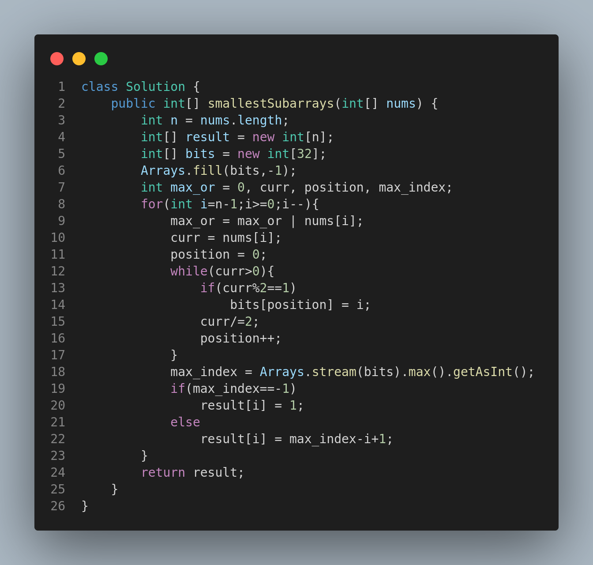

# Leetcode 2411: Smallest Subarrays With Maximum Bitwise OR

## 📘 Problem Statement

You are given a 0-indexed array `nums` of length `n`, consisting of **non-negative integers**.  
For each index `i` from `0` to `n - 1`, you must determine the size of the minimum sized **non-empty subarray** of `nums` starting at `i` (inclusive) that has the **maximum possible bitwise OR**.

### 🧮 Definition:
Let `Bij` be the bitwise OR of the subarray `nums[i...j]`. You need to find the **smallest** subarray starting at `i`, such that the bitwise OR of this subarray is equal to `max(Bik)` where `i <= k <= n - 1`.

Return an integer array `answer` of size `n` where `answer[i]` is the **length of the minimum subarray** starting at `i` with **maximum bitwise OR**.

---

## 🧪 Examples

### Example 1:
**Input:** `nums = [1,0,2,1,3]`  
**Output:** `[3,3,2,2,1]`

**Explanation:**
- Maximum OR from index 0 onwards: `3`
- Minimum subarray giving this OR:
  - Index 0: `[1,0,2]` → OR = 3
  - Index 1: `[0,2,1]` → OR = 3
  - Index 2: `[2,1]` → OR = 3
  - Index 3: `[1,3]` → OR = 3
  - Index 4: `[3]` → OR = 3

---

### Example 2:
**Input:** `nums = [1,2]`  
**Output:** `[2,1]`

**Explanation:**
- From index 0: OR of `[1,2]` is 3 → Length = 2
- From index 1: OR of `[2]` is 2 → Length = 1

---

## Approach

1. Traverse the array in reverse.
2. Maintain an array `bits` of size 32 to record the last position where each bit is set.
3. For each index `i`, determine the farthest bit index needed to form the OR using `bits`.
4. Result at index `i` is `max_index - i + 1`.

---

## Code

---

## ⏱️ Time & Space Complexity

- **Time Complexity:** `O(32 * n)` = `O(n)`  
  (Each bit is checked for each element at most once)
- **Space Complexity:** `O(32)` = `O(1)`  
  (Constant size for `bits` array)

---

## 📚 Constraints

- `1 <= n <= 10⁵`
- `0 <= nums[i] <= 10⁹`

---

## 🔗 Related Topics

- Bit Manipulation
- Dynamic Programming
- Greedy
- Array

---
