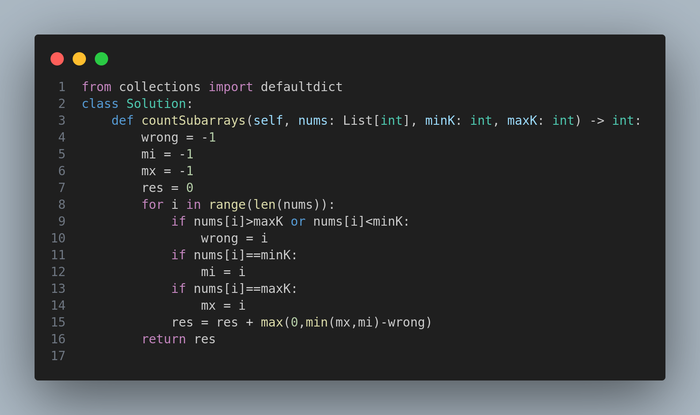

# 2444. Count Subarrays With Fixed Bounds

## Problem Description
You are given an integer array `nums` and two integers `minK` and `maxK`.

A **fixed-bound subarray** of `nums` is a subarray that satisfies the following conditions:
- The **minimum value** in the subarray is equal to `minK`.
- The **maximum value** in the subarray is equal to `maxK`.

Return the number of fixed-bound subarrays.

A **subarray** is a contiguous part of an array.

---

## Examples

### Example 1:
**Input:**
```
nums = [1,3,5,2,7,5], minK = 1, maxK = 5
```
**Output:**
```
2
```
**Explanation:** The fixed-bound subarrays are:
- [1,3,5]
- [1,3,5,2]

### Example 2:
**Input:**
```
nums = [1,1,1,1], minK = 1, maxK = 1
```
**Output:**
```
10
```
**Explanation:** Every subarray of `nums` is a fixed-bound subarray. Total number of subarrays of length 4 = 10.

---

## Constraints
- `2 <= nums.length <= 10^5`
- `1 <= nums[i], minK, maxK <= 10^6`

---

## Code Snapshot


---

## Key Insight
The key to solving this problem efficiently is to track the last positions where the `minK`, `maxK`, and out-of-bound values occurred. This enables linear time complexity by using a sliding window approach that only adds valid subarrays where both bounds are included and no invalid numbers are in between.

---

