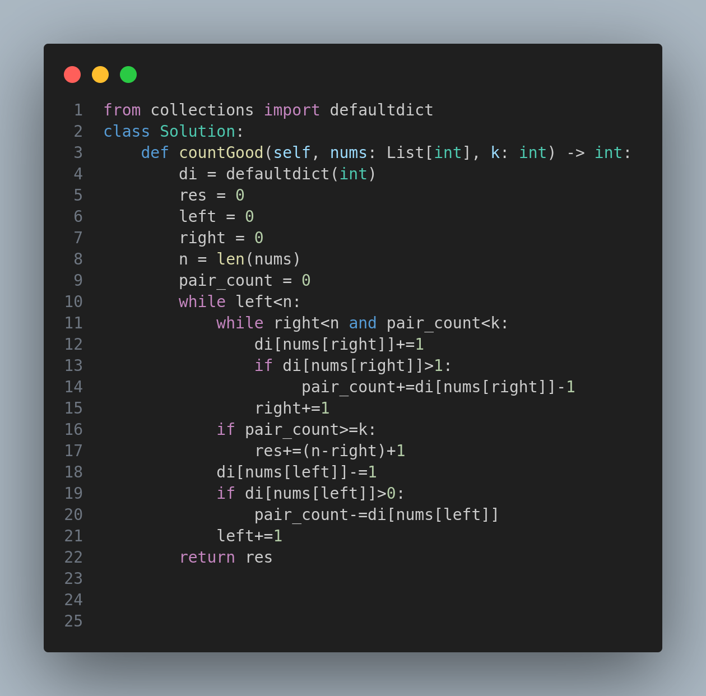

---

# 2537. Count the Number of Good Subarrays

## Problem Statement

You are given an integer array `nums` and an integer `k`. Return the **number of good subarrays** of `nums`.

A subarray `arr` is **good** if there are **at least `k` pairs of indices (i, j)** such that `i < j` and `arr[i] == arr[j]`.

A subarray is a **contiguous** non-empty sequence of elements within an array.

---

## Constraints

- `1 <= nums.length <= 10^5`
- `1 <= nums[i], k <= 10^9`

---

## Examples

### Example 1:
**Input:** `nums = [1,1,1,1,1]`, `k = 10`  
**Output:** `1`

**Explanation:** The only good subarray is the entire array itself.

---

### Example 2:
**Input:** `nums = [3,1,4,3,2,2,4]`, `k = 2`  
**Output:** `4`

**Explanation:** The 4 good subarrays are:
- `[3,1,4,3,2,2]` (2 pairs)
- `[3,1,4,3,2,2,4]` (3 pairs)
- `[1,4,3,2,2,4]` (2 pairs)
- `[4,3,2,2,4]` (2 pairs)

---

## Approach

To efficiently solve this problem:

1. Use a **two-pointer sliding window** to track valid subarrays.
2. Maintain a **dictionary** to store the frequency of elements in the current window.
3. Track the number of **valid pairs** in the current window using the formula: if an element appears `f` times, it contributes `f * (f - 1) / 2` pairs.
4. Expand the right boundary until the pair count reaches or exceeds `k`.
5. For every valid left index, count all possible right subarrays that are good.
6. Shrink the left pointer and update the dictionary and pair count accordingly.

---

## Code

The implementation of the solution is illustrated below:

---

