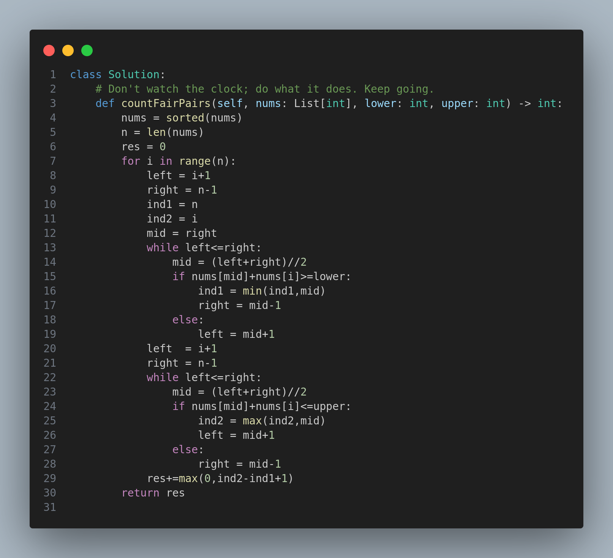

# 2563. Count the Number of Fair Pairs

## Problem Statement

Given a **0-indexed integer array** `nums` of size `n` and two integers `lower` and `upper`, return the number of **fair pairs**.

A **fair pair** is defined as a pair of indices `(i, j)` where:

- `0 <= i < j < n`
- `lower <= nums[i] + nums[j] <= upper`

---

## Example

### Example 1

**Input:**  
`nums = [0,1,7,4,4,5]`, `lower = 3`, `upper = 6`  
**Output:**  
`6`  
**Explanation:**  
There are 6 fair pairs:
- (0,3), (0,4), (0,5)
- (1,3), (1,4), (1,5)

---

### Example 2

**Input:**  
`nums = [1,7,9,2,5]`, `lower = 11`, `upper = 11`  
**Output:**  
`1`  
**Explanation:**  
Only one fair pair: (2,3)

---

## Constraints

- `1 <= nums.length <= 10⁵`
- `-10⁹ <= nums[i] <= 10⁹`
- `-10⁹ <= lower <= upper <= 10⁹`

---

## Approach

The core idea is to **sort the array** and use **binary search** to find the number of valid pairs for each element.

### Steps:
1. Sort the input array `nums`.
2. Iterate through each index `i`:
   - Use **binary search** to find the first index `ind1` such that `nums[i] + nums[ind1] >= lower`.
   - Use another binary search to find the last index `ind2` such that `nums[i] + nums[ind2] <= upper`.
3. The number of fair pairs for each `i` is `(ind2 - ind1 + 1)` if `ind2 >= ind1`.
4. Accumulate this count into the result.

---

## Time Complexity

- Sorting: **O(n log n)**
- For each index: two binary searches → **O(log n)**
- Total: **O(n log n)**

---

## Code

---

