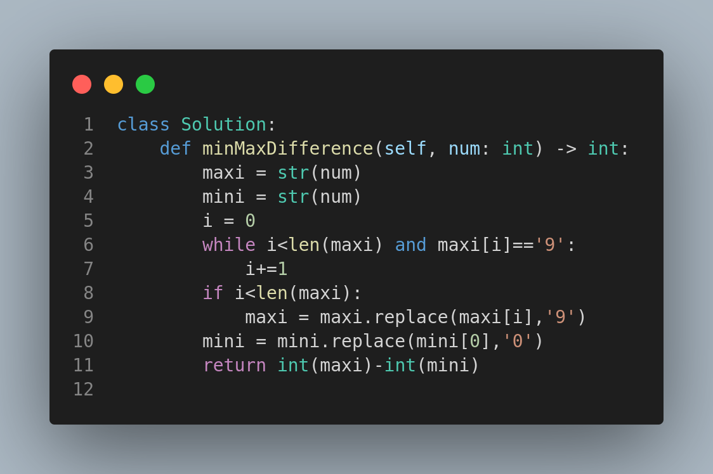

# 386. Lexicographical Numbers

## Problem Statement

Given an integer `n`, return all the numbers in the range `[1, n]` sorted in **lexicographical order**.

You **must write an algorithm that runs in `O(n)` time and uses `O(1)` extra space**.

---

## Example

### Example 1:

**Input:**

```
n = 13
```

**Output:**

```
[1, 10, 11, 12, 13, 2, 3, 4, 5, 6, 7, 8, 9]
```

### Example 2:

**Input:**

```
n = 2
```

**Output:**

```
[1, 2]
```

---

## Constraints

* `1 <= n <= 5 * 10^4`

---

## Optimal Solution Approach

To meet the `O(n)` time and `O(1)` space requirements, we perform a **depth-first traversal** from 1 to n, exploring each number's lexicographical children by multiplying by 10 or incrementing. This avoids creating the entire list upfront and sorting.

---

## Visual Reference



The image above outlines a simple approach but **note that this method does not meet the O(n)/O(1)** constraint. A more optimal DFS approach would be required for large inputs.

---

## Key Takeaways

* Lexicographical order is not the same as numerical order.
* A DFS traversal can efficiently generate such an ordering without full sorting.
* Be mindful of space and time constraints when solving large input problems.

---

⭐ *If you found this helpful or have improvements, feel free to contribute!*

# 3423. Maximum Difference Between Adjacent Elements in a Circular Array

## Problem Statement

Given a circular array `nums`, find the maximum **absolute difference** between adjacent elements.

📌 **Note:** In a circular array, the first and last elements are considered adjacent.

---

## Examples

### Example 1:

**Input:**

```
nums = [1, 2, 4]
```

**Output:**

```
3
```

**Explanation:** `|4 - 1| = 3` is the maximum difference.

### Example 2:

**Input:**

```
nums = [-5, -10, -5]
```

**Output:**

```
5
```

**Explanation:** `|-5 - (-10)| = 5` is the maximum difference.

---

## Constraints

* `2 <= nums.length <= 100`
* `-100 <= nums[i] <= 100`

---

## Approach

1. Iterate through the array from the second to the second-last element.
2. For each element, compute `|nums[i-1] - nums[i+1]|` and update the result.
3. Don't forget to check the circular cases: `|nums[-1] - nums[1]|` and `|nums[-2] - nums[0]|`.

This approach ensures we evaluate all adjacent pairs, including the circular ones.

---

## Summary

* This is a simple yet effective problem that focuses on **edge handling in circular arrays**.
* It's important to consider the array's boundaries for a correct solution.

✅ Suitable for beginners familiar with absolute differences and list indexing.

# 2566. Maximum Difference by Remapping a Digit

## Problem Statement

You are given an integer `num`. You know that Bob will sneakily **remap** one of the 10 possible digits (0 to 9) to another digit.

Return the **difference** between the maximum and minimum values Bob can make by remapping **exactly one digit** in `num`.

### Notes:

* Bob replaces **all** occurrences of a digit with another digit.
* Bob can use different remappings for maximum and minimum values.
* The resulting number may have leading zeroes.

---

## Examples

### Example 1:

**Input:**

```
num = 11891
```

**Output:**

```
99009
```

**Explanation:**

* Max: Replace `1` → `9` → 99899
* Min: Replace `1` → `0` → 890
* Diff = 99899 - 890 = 99009

### Example 2:

**Input:**

```
num = 90
```

**Output:**

```
99
```

**Explanation:**

* Max: Replace `0` → `9` → 99
* Min: Replace `9` → `0` → 0
* Diff = 99 - 0 = 99

---

## Constraints

* `1 <= num <= 10^8`

---

## Approach

1. Convert number to string.
2. For **maximum**, replace the **first non-9** digit with `9`.
3. For **minimum**, replace the **first digit** with `0`.
4. Convert both to integers and return the difference.

---

## Visual Reference


---

## Summary

* Understand the effect of digit-wide remapping.
* Watch for **leading digits** during remapping.
* A good exercise for basic string manipulation and greedy thinking.
