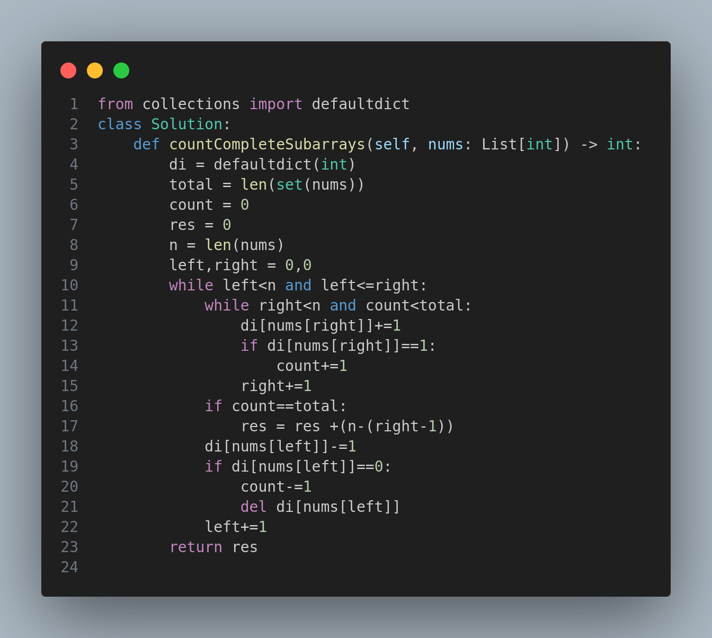

# 2799. Count Complete Subarrays in an Array

## Problem Description

You are given an array `nums` consisting of positive integers.

We call a subarray of an array **complete** if the following condition is satisfied:

- The number of **distinct elements** in the subarray is equal to the number of **distinct elements** in the whole array.

Return the number of complete subarrays.

A **subarray** is a contiguous non-empty part of an array.

---

## Examples

### Example 1:

**Input:**
```python
nums = [1,3,1,2,2]
```

**Output:**
```
4
```

**Explanation:**
The complete subarrays are:
- [1,3,1,2]
- [1,3,1,2,2]
- [3,1,2]
- [3,1,2,2]

### Example 2:

**Input:**
```python
nums = [5,5,5,5]
```

**Output:**
```
10
```

**Explanation:**
All subarrays are complete because they only contain the number 5. The total number of subarrays is 10.

---

## Constraints

- `1 <= nums.length <= 1000`
- `1 <= nums[i] <= 2000`

---

## Python Code



---

## Intuition and Explanation

- We first count how many distinct elements are in the entire array using `set(nums)`.
- We then use a sliding window (two pointers `left` and `right`) to find subarrays that contain all those distinct elements.
- When we find such a window, we count how many subarrays starting at `left` and ending from `right` to `n` will satisfy the complete condition.
- We keep a frequency map to track the distinct numbers in the current window.

---

## Time Complexity

- **O(n²)** in the worst case since both pointers can independently go up to `n`.

---

## Space Complexity

- **O(n)** for the frequency dictionary.

---

## Tags

- Sliding Window
- Hash Map
- Two Pointers
- Arrays

