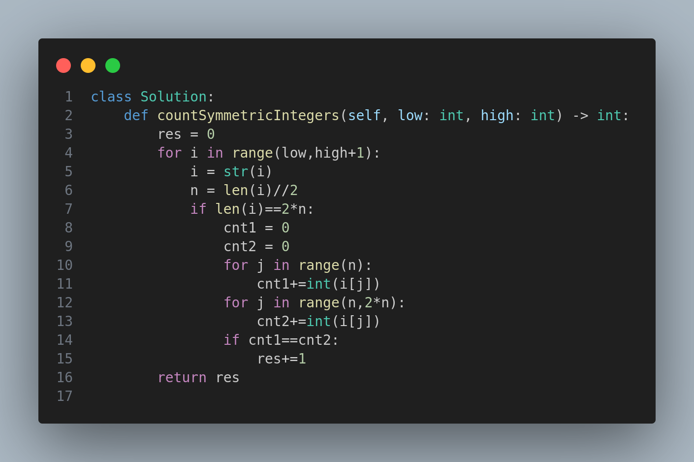

Here’s the `README.md` for **Leetcode 2843. Count Symmetric Integers**, referencing the `image.png` for the code:

---

# 2843. Count Symmetric Integers

## Problem Statement

You are given two positive integers `low` and `high`.

An integer `x` consisting of `2 * n` digits is **symmetric** if the sum of the first `n` digits of `x` is equal to the sum of the last `n` digits of `x`.

> 🔸 Numbers with an **odd number of digits are never symmetric**.

Your task is to return the number of **symmetric integers** in the range `[low, high]`.

---

## Constraints

- `1 <= low <= high <= 10⁴`

---

## Examples

### Example 1:
**Input:**  
`low = 1`, `high = 100`  
**Output:**  
`9`  
**Explanation:**  
There are 9 symmetric integers between 1 and 100:  
**11, 22, 33, 44, 55, 66, 77, 88, 99**

---

### Example 2:
**Input:**  
`low = 1200`, `high = 1230`  
**Output:**  
`4`  
**Explanation:**  
There are 4 symmetric integers between 1200 and 1230:  
**1203, 1212, 1221, 1230**

---

## Approach

1. Loop through every integer `i` in the range `[low, high]`.
2. Convert `i` to a string to easily access individual digits.
3. If the length of the number is even:
   - Split the digits into two halves.
   - Compute the sum of digits in both halves.
   - If the two sums are equal, it's a symmetric number.
4. Count and return the total number of such symmetric numbers.

---

## Code

The Python solution for this problem is shown in the image below:

---

