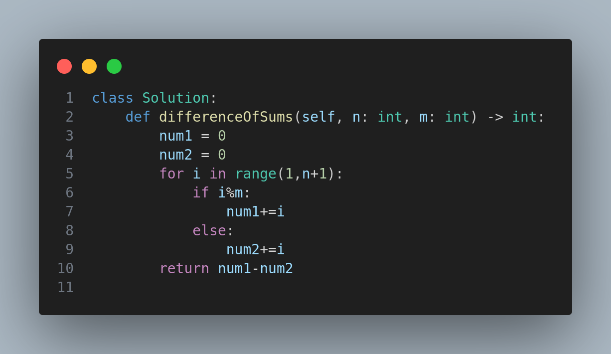

# Divisible and Non-divisible Sums Difference

### Problem: Leetcode 2894 — Divisible and Non-divisible Sums Difference

Given two positive integers `n` and `m`, the task is to:

* **Calculate `num1`**: the sum of all integers from `1` to `n` (inclusive) that are **not divisible by** `m`.
* **Calculate `num2`**: the sum of all integers from `1` to `n` that **are divisible by** `m`.
* **Return** the result of `num1 - num2`.

---

### Example 1:

**Input:**

```
n = 10, m = 3
```

**Explanation:**

* Numbers not divisible by 3: \[1, 2, 4, 5, 7, 8, 10] → `num1 = 37`
* Numbers divisible by 3: \[3, 6, 9] → `num2 = 18`
* Result: `37 - 18 = 19`

**Output:**

```
19
```

---

### Example 2:

**Input:**

```
n = 5, m = 6
```

**Explanation:**

* All numbers from 1 to 5 are **not divisible** by 6 → `num1 = 15`
* No number between 1 to 5 is divisible by 6 → `num2 = 0`
* Result: `15 - 0 = 15`

**Output:**

```
15
```

---

### Example 3:

**Input:**

```
n = 5, m = 1
```

**Explanation:**

* All numbers from 1 to 5 are divisible by 1 → `num2 = 15`
* No numbers are excluded → `num1 = 0`
* Result: `0 - 15 = -15`

**Output:**

```
-15`
```

---

### Constraints:

* 1 <= n, m <= 1000

---

### Approach:

To solve this problem efficiently:

* Iterate from 1 to `n`.
* If the current number `i` is divisible by `m`, add it to `num2`.
* Otherwise, add it to `num1`.
* Return the result of `num1 - num2`.

---

### Visual Illustration:

For a quick overview of how the logic is implemented, refer to the following diagram:


