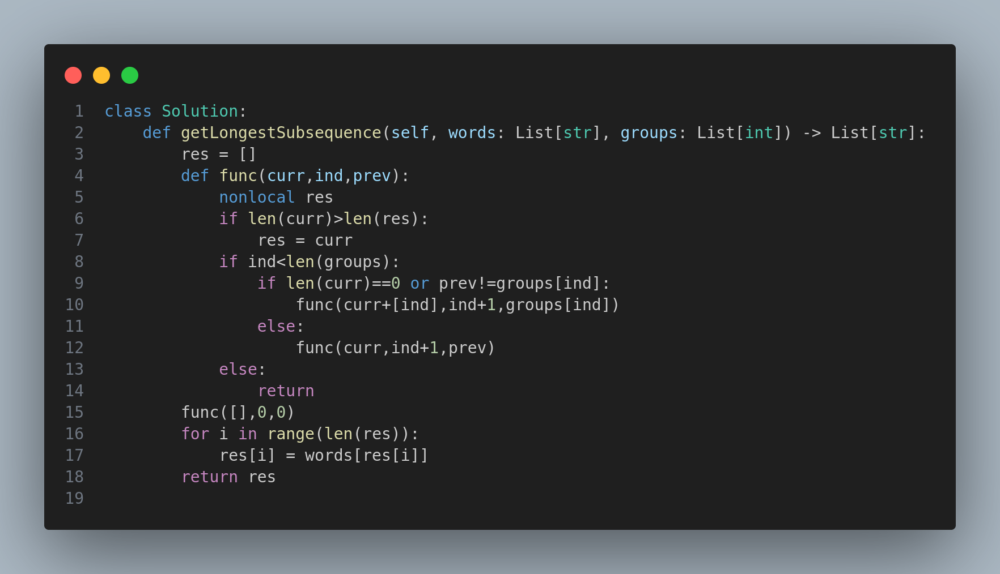

# 2900. Longest Unequal Adjacent Groups Subsequence I



## Problem Statement

You are given a string array `words` and a binary array `groups` both of length `n`, where `words[i]` is associated with `groups[i]`.

Your task is to select the longest alternating subsequence from `words`. A subsequence of words is alternating if for any two consecutive strings in the sequence, their corresponding elements in the binary array `groups` differ. Essentially, you are to choose strings such that adjacent elements have non-matching corresponding bits in the `groups` array.

Formally, you need to find the longest subsequence of an array of indices `[0, 1, ..., n - 1]` denoted as `[i0, i1, ..., ik-1]`, such that `groups[ij] != groups[ij+1]` for each `0 <= j < k - 1` and then find the words corresponding to these indices.

Return the selected subsequence. If there are multiple answers, return any of them.

Note: The elements in `words` are distinct.

---

## Example 1

**Input:**

```
words = ["e","a","b"]
groups = [0,0,1]
```

**Output:**

```
["e","b"]
```

**Explanation:**
A subsequence that can be selected is `["e","b"]` because `groups[0] != groups[2]`. Another subsequence that can be selected is `["a","b"]` because `groups[1] != groups[2]`. It can be demonstrated that the length of the longest subsequence of indices that satisfies the condition is 2.

---

## Example 2

**Input:**

```
words = ["a","b","c","d"]
groups = [1,0,1,1]
```

**Output:**

```
["a","b","c"]
```

**Explanation:**
A subsequence that can be selected is `["a","b","c"]` because `groups[0] != groups[1]` and `groups[1] != groups[2]`. Another subsequence that can be selected is `["a","b","d"]` because `groups[0] != groups[1]` and `groups[1] != groups[3]`. It can be shown that the length of the longest subsequence that satisfies the condition is 3.

---

## Constraints

* `1 <= n == words.length == groups.length <= 100`
* `1 <= words[i].length <= 10`
* `groups[i]` is either 0 or 1.
* `words` consists of distinct strings.
* `words[i]` consists of lowercase English letters.
