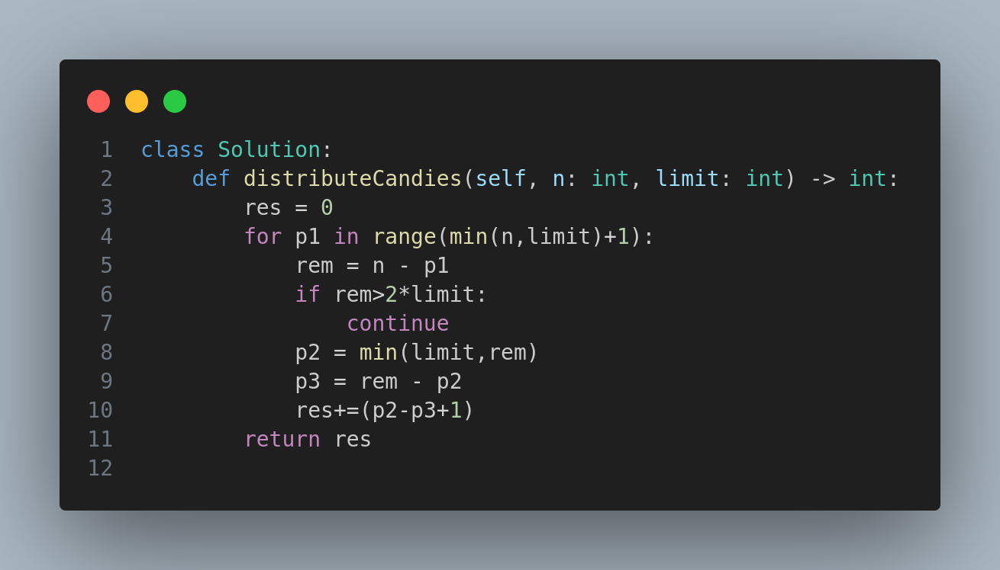

# 2929. Distribute Candies Among Children II

## Problem Statement

You are given two positive integers `n` and `limit`.

Return the total number of ways to distribute `n` candies among **3 children** such that no child gets more than `limit` candies.

---

## Examples

### Example 1:

**Input:**

```
n = 5
limit = 2
```

**Output:**

```
3
```

**Explanation:**
There are 3 valid distributions:

* (1, 2, 2)
* (2, 1, 2)
* (2, 2, 1)

---

### Example 2:

**Input:**

```
n = 3
limit = 3
```

**Output:**

```
10
```

**Explanation:**
All valid distributions:

* (0, 0, 3)
* (0, 1, 2)
* (0, 2, 1)
* (0, 3, 0)
* (1, 0, 2)
* (1, 1, 1)
* (1, 2, 0)
* (2, 0, 1)
* (2, 1, 0)
* (3, 0, 0)

---

## Constraints

* `1 <= n <= 10^6`
* `1 <= limit <= 10^6`

---

## Approach

To solve this problem efficiently:

1. Loop over all possible values for the first child (0 to min(n, limit)).
2. For each value, compute the remaining candies.
3. Use this to calculate how many valid distributions exist for the other two children within the given `limit`.

This reduces the problem to counting the number of integer solutions to the equation `x + y = rem`, constrained by `0 <= x, y <= limit`.

---

## Solution

The Python code implementing this approach is provided in the image below:



---


