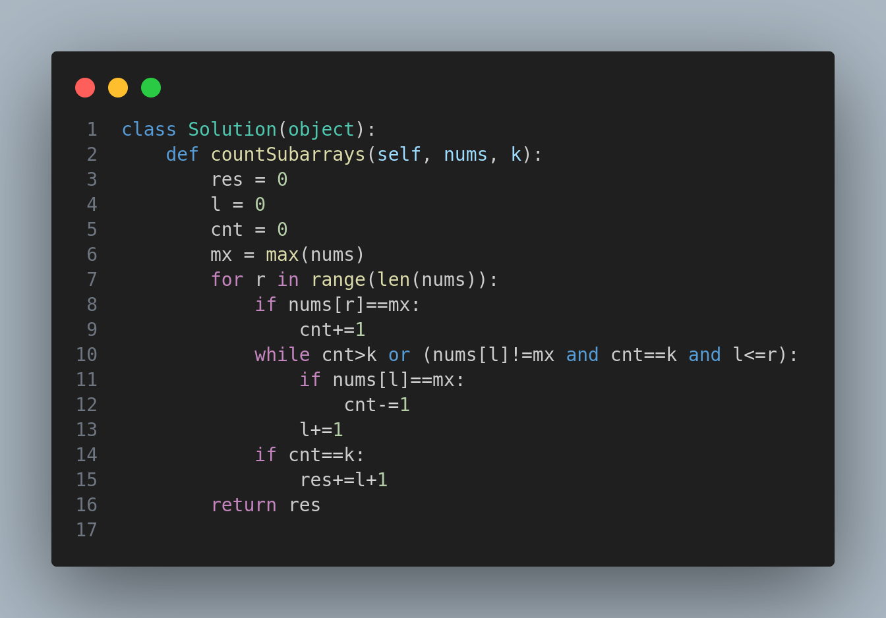

# 📊 2962. Count Subarrays Where Max Element Appears at Least K Times

## 🧩 Problem Description
You are given an integer array `nums` and a positive integer `k`.

Return the number of **subarrays** where the **maximum element** of `nums` appears **at least** `k` times in that subarray.

> A subarray is a contiguous sequence of elements within an array.

---

## 🧠 Example 1:
**Input:**
```
nums = [1,3,2,3,3]
k = 2
```
**Output:**
```
6
```
**Explanation:**
The subarrays where the element `3` (the maximum) appears **at least 2 times** are:
- [1,3,2,3]
- [1,3,2,3,3]
- [3,2,3]
- [3,2,3,3]
- [2,3,3]
- [3,3]

---

## 🧠 Example 2:
**Input:**
```
nums = [1,4,2,1]
k = 3
```
**Output:**
```
0
```
**Explanation:**
The element `4` (maximum in array) does **not appear at least 3 times** in any subarray.

---

## ✅ Constraints:
- `1 <= nums.length <= 10^5`
- `1 <= nums[i] <= 10^6`
- `1 <= k <= 10^5`

---

## 📷 Visual Representation


---

## 🏷️ Tags
`Sliding Window`, `Two Pointers`, `Subarrays`, `Medium`, `Frequency Count`, `Contiguous Array`

---

## 🏢 Companies Asked
*Amazon*, *Adobe*, *Google*

