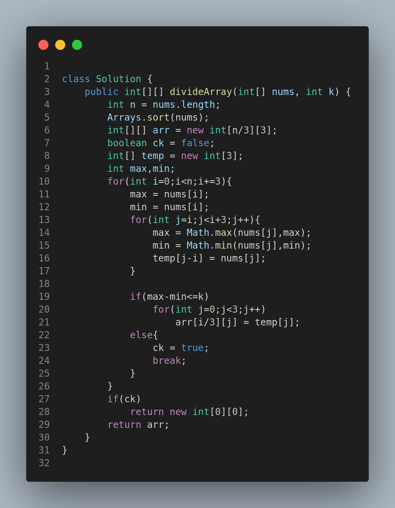

# 2966. Divide Array Into Arrays With Max Difference

## Problem Statement

You are given an integer array `nums` of size `n` where `n` is a multiple of 3 and a positive integer `k`.

Divide the array `nums` into `n / 3` arrays of size 3 satisfying the following condition:

* The **difference between any two elements** in one array is **less than or equal to** `k`.

Return a **2D array** containing the arrays. If it is impossible to satisfy the conditions, return an **empty array**. If there are multiple answers, return any of them.

---

## Examples

### Example 1:

**Input:**

```
nums = [1,3,4,8,7,9,3,5,1], k = 2
```

**Output:**

```
[[1,1,3],[3,4,5],[7,8,9]]
```

**Explanation:**
All groups have a max difference ≤ 2.

### Example 2:

**Input:**

```
nums = [2,4,2,2,5,2], k = 2
```

**Output:**

```
[]
```

**Explanation:**
It is not possible to group without exceeding a difference of 2.

### Example 3:

**Input:**

```
nums = [4,2,9,8,2,12,7,12,10,5,8,5,5,7,9,2,5,11], k = 14
```

**Output:**

```
[[2,2,12],[4,8,5],[5,9,7],[7,8,5],[5,9,10],[11,12,2]]
```

**Explanation:**
All groups meet the condition with difference ≤ 14.

---

## Constraints

* `n == nums.length`
* `1 <= n <= 10^5`
* `n` is a multiple of `3`
* `1 <= nums[i] <= 10^5`
* `1 <= k <= 10^5`

---

## Approach

1. **Sort the array** to group close elements together.
2. Traverse in steps of 3:

   * For every group of 3, calculate the max and min.
   * If `max - min <= k`, add the group.
   * Else, return an empty array.
3. Return the grouped result.

This greedy approach ensures that we group closest elements, improving the chances of satisfying the condition.

---

## Visual Representation



---

## Summary

* Sorting simplifies the process of grouping close values.
* Greedily group every 3 consecutive elements.
* If any group fails the condition, return an empty array.
* Time Complexity: **O(n log n)** due to sorting.

Ideal for practicing greedy strategies with array manipulation and constraints handling.
