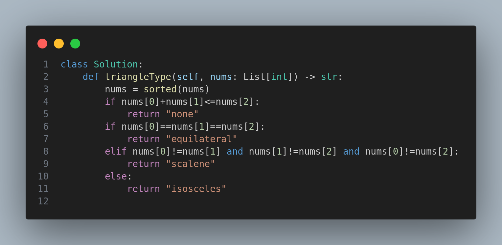

# 3024. Type of Triangle



## Problem Statement

You are given a 0-indexed integer array `nums` of size 3 which can form the sides of a triangle.

A triangle is called:

* **Equilateral** if it has all sides of equal length.
* **Isosceles** if it has exactly two sides of equal length.
* **Scalene** if all its sides are of different lengths.

Return a string representing the type of triangle that can be formed, or "none" if it cannot form a triangle.

---

## Example 1

**Input:**

```
nums = [3,3,3]
```

**Output:**

```
equilateral
```

**Explanation:**
All the sides are of equal length, so it forms an equilateral triangle.

---

## Example 2

**Input:**

```
nums = [3,4,5]
```

**Output:**

```
scalene
```

**Explanation:**

* 3 + 4 = 7 > 5
* 3 + 5 = 8 > 4
* 4 + 5 = 9 > 3
  All triangle conditions are satisfied.
  All sides are of different lengths, so it forms a scalene triangle.

---

## Constraints

* `nums.length == 3`
* `1 <= nums[i] <= 100`
