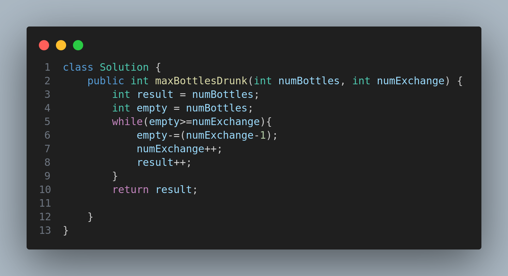

# Water Bottles II – LeetCode 3100

## 📌 Problem Description

You are given two integers:

* **`numBottles`** → the number of full water bottles you initially have.
* **`numExchange`** → the number of empty bottles required to exchange for one full water bottle.

### Operations Allowed:

1. Drink any number of full water bottles (they become empty bottles).
2. Exchange **`numExchange`** empty bottles for **one full bottle**, then **increase `numExchange` by 1**.

⚠️ You cannot perform multiple exchanges at the same time with the same `numExchange` value.

Your task is to **return the maximum number of water bottles you can drink**.

---

## 📝 Examples

### Example 1:

**Input:**

```
numBottles = 13, numExchange = 6
```

**Output:**

```
15
```

### Example 2:

**Input:**

```
numBottles = 10, numExchange = 3
```

**Output:**

```
13
```

---

## 💡 Constraints

* `1 <= numBottles <= 100`
* `1 <= numExchange <= 100`

---

## 🚀 Solution

The solution uses a **simulation approach**:

* Start with the initial full bottles.
* Keep drinking until you can no longer exchange.
* Each time an exchange is made, `numExchange` increases by 1, making future exchanges more expensive.

The implementation is shown below:



---

## ✅ Complexity Analysis

* **Time Complexity:** `O(numBottles)` → each exchange and bottle consumption is processed sequentially.
* **Space Complexity:** `O(1)` → only a few integer variables are used.

---
