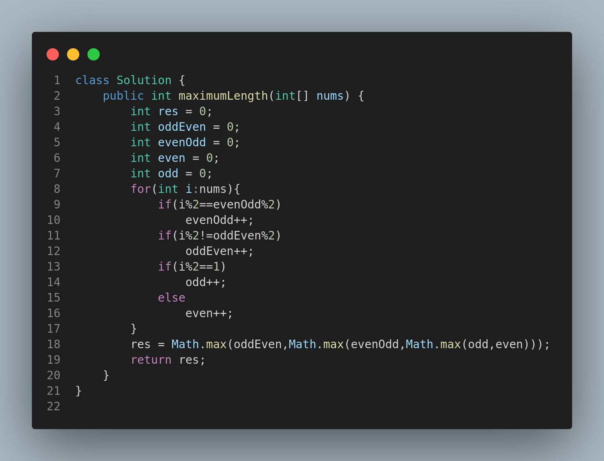

# 3201. Find the Maximum Length of Valid Subsequence I

## Problem Statement

You are given an integer array `nums`.

A **subsequence** of `nums` with length `x` is called **valid** if it satisfies:

```
(sub[0] + sub[1]) % 2 == (sub[1] + sub[2]) % 2 == ... == (sub[x - 2] + sub[x - 1]) % 2
```

Return the length of the **longest valid subsequence** of `nums`.

A subsequence is an array that can be derived from another array by deleting some or no elements without changing the order of the remaining elements.

---

## Examples

### Example 1:

**Input:**

```
nums = [1,2,3,4]
```

**Output:**

```
4
```

**Explanation:**
The entire sequence is valid: \[1, 2, 3, 4].

---

### Example 2:

**Input:**

```
nums = [1,2,1,1,2,1,2]
```

**Output:**

```
6
```

**Explanation:**
A valid alternating subsequence: \[1, 2, 1, 2, 1, 2]

---

### Example 3:

**Input:**

```
nums = [1,3]
```

**Output:**

```
2
```

**Explanation:**
\[1, 3] is valid because (1 + 3) % 2 = 0.

---

## Constraints

* `2 <= nums.length <= 2 * 10^5`
* `1 <= nums[i] <= 10^7`

---

## Approach

1. We are interested in maintaining a valid sequence where:

   * The parity of the **sum of consecutive pairs** is consistent.
   * This condition can be fulfilled by two alternating strategies:

     * Even-Odd-Even...
     * Odd-Even-Odd...

2. We simulate both patterns using counters:

   * `evenOdd`: Starts with even index having even number.
   * `oddEven`: Starts with odd index having even number.
   * We also track total even and odd numbers independently.

3. Finally, we return the **maximum** of these 4 counts as the result.

---

## Code Representation


---

## Summary

* Greedy simulation with tracking of multiple valid subsequences.
* Time complexity: **O(N)** (one pass through the array).
* Uses simple parity checks and max calculation.

---
