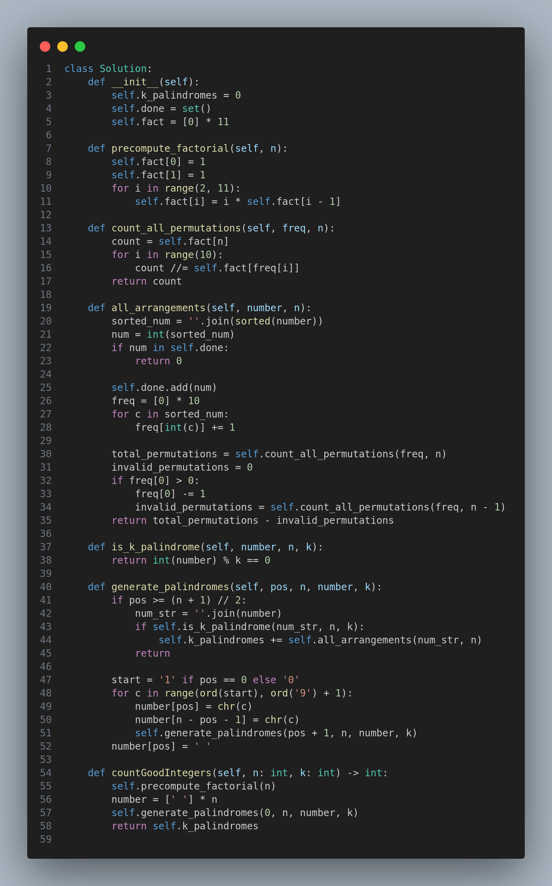

---

# 3272. Find the Count of Good Integers

## Problem Statement

You're given two integers `n` and `k`.

An integer `x` is called a **k-palindromic** if:

- `x` is a **palindrome**.
- `x` is **divisible by k**.

An integer is called **good** if its digits can be **rearranged** to form a k-palindromic integer.

> 💡 **Note:** An integer must not have leading zeros, neither before nor after rearrangement.

---

## Task

Return the **count of good integers** that contain exactly `n` digits.

---

## Constraints

- `1 <= n <= 10`
- `1 <= k <= 9`

---

## Examples

### Example 1:
**Input:** `n = 3`, `k = 5`  
**Output:** `27`

**Explanation:**  
Some of the good integers are:  
- `551` → can be rearranged to form `515` (palindrome and divisible by 5)  
- `525` → already k-palindromic

---

### Example 2:
**Input:** `n = 1`, `k = 4`  
**Output:** `2`  
**Explanation:** The good integers are `4` and `8`.

---

### Example 3:
**Input:** `n = 5`, `k = 6`  
**Output:** `2468`

---

## Approach

To solve this problem efficiently:

1. **Generate all valid palindromes** with `n` digits.
2. Check if the palindrome is divisible by `k`.
3. For each such k-palindromic number, calculate how many permutations of its digits form different good integers (excluding those with leading zeros).
4. Use a **factorial-based method** for counting unique permutations considering digit frequencies.
5. Use memoization to avoid recalculating permutations for repeated digit sets.

---

## Code

The implementation is shown in the image below:

---

