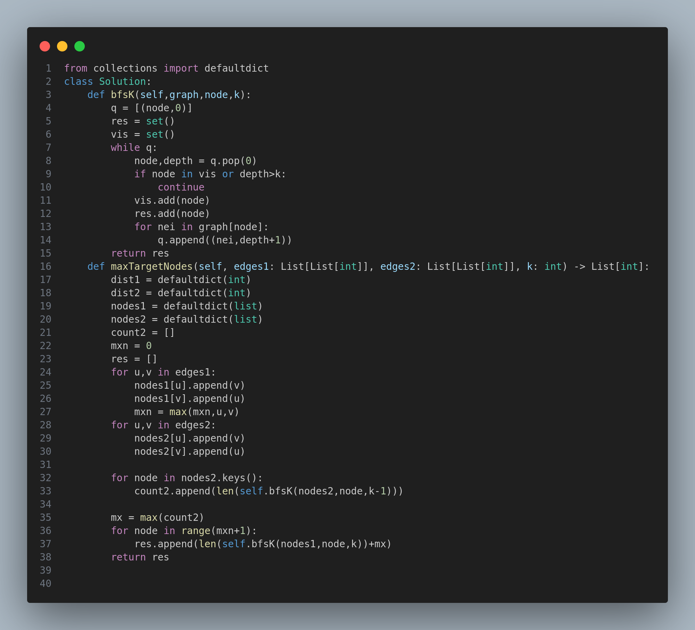

# Maximize the Number of Target Nodes After Connecting Trees I

This project solves the problem of determining the maximum number of reachable nodes (called "target nodes") in a forest of two undirected trees when we are allowed to temporarily connect a node from the first tree to any node in the second tree.

---

## Problem Description

Given:

* Two undirected trees: Tree1 with `n` nodes and Tree2 with `m` nodes.
* Edges `edges1` defining Tree1.
* Edges `edges2` defining Tree2.
* A non-negative integer `k`.

A node `u` is a **target** of node `v` if the shortest path from `u` to `v` has length `\u2264 k`.

The goal is to compute an array `answer` of length `n` such that `answer[i]` gives the **maximum** number of target nodes node `i` in Tree1 can reach **after connecting it to one node** in Tree2 (the optimal one).

---

## Example

**Input:**

```
edges1 = [[0,1],[0,2],[2,3],[2,4]]
edges2 = [[0,1],[0,2],[0,3],[2,7],[1,4],[4,5],[4,6]]
k = 2
```

**Output:**

```
[9, 7, 9, 8, 8]
```

**Explanation:**

* For node 0 in Tree1, connecting to node 0 in Tree2 gives access to 9 target nodes in total.
* For node 1 in Tree1, connecting to node 0 in Tree2 gives access to 7 nodes.
* And so on.

---

## Approach

This solution uses **Breadth-First Search (BFS)** to count how many nodes are reachable from each node within depth `\u2264 k`.

1. **Build adjacency lists** for both trees from the given edge lists.
2. For every node in Tree2:

   * Use BFS to count the number of nodes reachable within `k - 1` depth (because 1 edge will be used to connect to Tree1).
   * Keep track of the maximum such count (`maxCount2`).
3. For every node in Tree1:

   * Use BFS to count how many nodes in Tree1 are reachable within depth `k`.
   * Add the previously computed `maxCount2` from Tree2.

This ensures we are always connecting to the best node in Tree2.

---

## Complexity

* **Time Complexity:** O(n \* (n + m)), where `n` and `m` are the number of nodes in Tree1 and Tree2 respectively.
* **Space Complexity:** O(n + m) due to BFS and adjacency lists.

---

## Visual Reference



The image above provides a diagram illustrating two trees, the BFS radius from a node, and how the connection to the optimal Tree2 node impacts reachability.

---

## Constraints

* 2 <= n, m <= 1000
* 0 <= k <= 1000
* Trees are always valid (n-1 and m-1 edges respectively)

---

## Tags

`Graph` `BFS` `Tree` `Optimization` `Medium`

---


